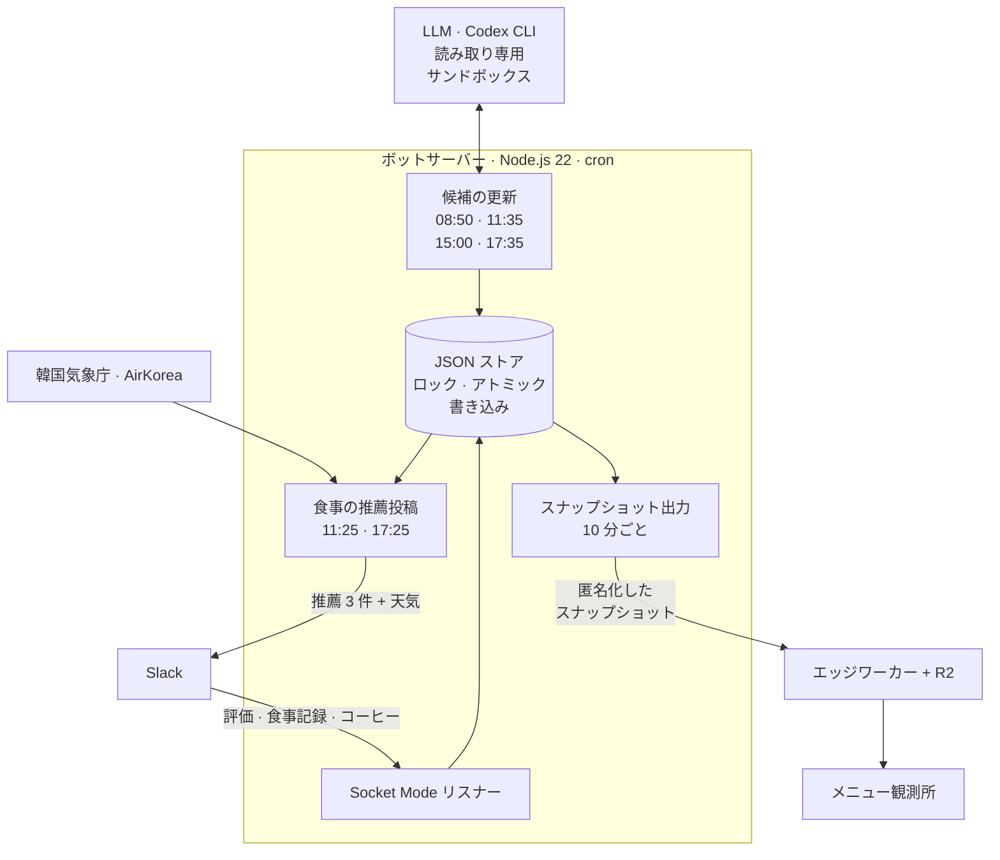

<div align="center">

[🇺🇸 English](README.md) · [🇨🇳 简体中文](README.zh-CN.md) · [🇭🇰 繁體中文](README.zh-HK.md) · **🇯🇵 日本語** · [🇰🇷 한국어](README.ko.md)


# Ojeommwo · 오점뭐

**今日のお昼、何食べる？** 大学の研究室に平日のランチとディナーを選ぶ Slack ボットと、<br>
すべての推薦をみんなの好みの地図に変える 3D 観測所です。

[**観測所を開く**](https://ojeommwo-observatory.jumincho.chatgpt.site/) · [仕組み](#仕組み) · [ローカルで動かす](#ローカルで動かす)

</div>

## 概要

*Ojeommwo*（오점뭐）は、韓国語の「오늘 점심 뭐 먹지?」（今日のお昼、何食べる？）の略です。韓国・全州にある全北大学校のある研究室のために作られました。

平日の 11:25 と 17:25（韓国時間、祝日を除く）に、ボットが Slack にデリバリーのおすすめを 3 つ投稿します。3 つはカテゴリ・店・メニューがすべて異なります。研究室のメンバーがおすすめを評価し、実際に食べたものを記録すると、そのシグナルがベイズ型の好みモデルを更新し、次の推薦に反映されます。**メニュー観測所**は、その履歴全体を個人情報を除いた形で公開しています。

## 機能

### Slack ボット

- **1 食ごとに異なる 3 つの推薦。** カテゴリ・店・メニューが毎回すべて異なります。同じ店は 14 日間、同じメニューは 7 日間は再び選ばれません。
- **検証済みの候補だけ。** 食事として適切か、実在する支店か、7 日以内に確認した価格と 3 日以内のデリバリーの根拠があるか、半径 6 km 以内かを確認します。閉店やデリバリー停止が分かった候補は外します。
- **19 の食事カテゴリ。** 한식、치킨、분식、돈까스、족발/보쌈、찜/탕、구이、피자、중식、일식、회/해물、양식、아시안、샌드위치、샐러드、버거、멕시칸、도시락、죽。飲み物・デザート・軽食のみのメニューは対象外です。
- **Slack 上でフィードバック。** 推薦メニューを 1〜5 点とタグ（最大 3 つ）で評価し、推薦外も含めて実際に食べたメニューを記録し、「あとでコーヒー行く人？」に参加できます。
- **公式の気象情報。** 韓国気象庁と AirKorea のデータから、現在・体感・最高・最低気温、湿度、降水、気象特報、紫外線、粒子状物質（PM10・PM2.5）を知らせます。
- **判断が要るところは LLM、それ以外はコード。** GPT-6 Luna（xhigh 推論、Codex CLI 経由）が新しい候補をウェブで調べ、大ざっぱに入力された食事記録を正規化し、曖昧なカテゴリを再審査します。読み取り専用のサンドボックスで動き、スキーマで検証した JSON だけを返します。順位付け・好みの計算・有効期限・重複排除・保存は、テスト済みの決定的なコードが担います。

### メニュー観測所

- **3D コスモス**（3D 코스모스）：カテゴリが光る中心となり、メニューはその周りを巡る星になります。ドラッグで回転、ホイールで拡大、星をクリックすると詳細が開きます。
- **好みマップ**（취향 지도）：すべてのメニューを、カテゴリごとのレーン上の *苦手 0% · 中立 50% · 好き 100%* の軸に並べます。方向は文字・色・記号・模様で同時に示され、好み順のリスト表示にもすぐ切り替えられます。
- **フィルターと検索。** 複数のカテゴリを同時に選んだり、メニュー・店・主な食材で検索したりできます（例：`pork`）。
- **メニュー詳細。** 好み度、推薦された回数、食べた回数、評価数と平均、価格、デリバリーの確認状況を表示します。
- **メニューを眺める**（메뉴 둘러보기）：画面下にランダムなメニューが 5 つ並び、「다시 뽑기」（引き直す）で入れ替わります。
- **はじめからアクセシブル。** キーボード操作、「視差効果を減らす」設定、WebGL が使えない環境向けの代替表示に対応しています。ページは一度だけ読み込まれ、自動で再読み込みされません。

観測所の画面は韓国語です。

## 仕組み



- **投稿の前に候補を準備。** 調査と投稿は別のジョブで、任意の探索に失敗しても有効な準備済み候補は保持されます。毎食の前に価格・デリバリーの根拠・距離・クールダウン・多様性を再検証し、検証済みの候補が足りないときだけウェブを検索します。11:35 には新しい店を探す任意の探索をもう 1 回行います。
- **好みモデル。** 各メニューは Beta(3, 3) の事前分布から始まるベータ事後分布を持ちます。実際の食事は 1.0、アンケートは 0.9 の重みで、根拠は半減期 180 日で弱まり、18% の探索率で新しい選択肢を混ぜます。同じ人の繰り返し投票は抑えて反映します。同じ日は最新の 1 票だけ、異なる日は直近 3 日分を 1・0.5・0.25 倍で数えます。食事記録は同日以前のアンケートだけを置き換え、その後のアンケートは反映されます。後日の回答が増えると古い食事の影響は弱まります。結果は順位付けのシグナルであり、満足を保証するものではありません。
- **安全な保存。** ロック・アトミックなリネーム・fsync・整合性チェックを備えた JSON ファイルを使います。Slack への送信は outbox を経由するため、結果が不確かな送信をむやみに繰り返しません。
- **観測所のパイプライン。** サーバーが 10 分ごとにデータベースを検証し、個人情報を除いたスナップショットを作って、R2 オブジェクトストレージを使うエッジワーカーに公開します。ブラウザーはページを開いたときに最新のスナップショットを読み込みます。

## 技術スタック

| 構成 | 使用技術 |
| --- | --- |
| ボット | Node.js 22 以上（npm 依存なし）、Slack Web API・Socket Mode、Codex CLI |
| データ | 韓国気象庁・AirKorea のオープン API、JSON ストア |
| 観測所 | Next.js 16、React 19、vinext（Vite 8）、TypeScript、three.js、3d-force-graph |
| ホスティング | R2 ストレージを使う Workers 型のエッジ関数、オフラインビューアーを兼ねる静的エクスポート |

## リポジトリ構成

```text
.
├── src/             Slack ボット：推薦器、候補の調査、好みモデル、天気、ストレージ
├── scripts/         運用 CLI：ヘルスチェック、監査、候補の更新、定時投稿
├── test/            ボットのテスト
├── prompts/         LLM の構造化出力用 JSON スキーマ
├── config/          店・メニューの正規化エイリアス
├── data/            初期メニューと祝日カレンダー（運用データは含まない）
└── observatory/     メニュー観測所
    ├── app/         React UI：3D コスモス、好みマップ、フィルター、詳細パネル、メニューを眺める
    ├── worker/      エッジワーカー：スナップショット API、公開時の認証、セキュリティヘッダー
    ├── scripts/     スナップショットの出力・検証・公開
    ├── tests/       観測所のテスト
    └── public/data/ ローカルプレビュー用の匿名化済みサンプルスナップショット
```

## ローカルで動かす

### 観測所（認証情報は不要）

Node.js 22.13 以降と Corepack が必要です。

```sh
cd observatory
corepack pnpm install --frozen-lockfile
corepack pnpm dev
```

開発サーバーが表示する URL を開いてください。スナップショット API がない場合は、`public/data/snapshot.json` のサンプルを代わりに読み込みます。

```sh
corepack pnpm lint
corepack pnpm typecheck
```

`corepack pnpm test` は非公開の運用 DB がない場合、匿名化したサンプルと合成データを使います。実運用ストアの統合テスト 1 件は公開コピーでは明示的にスキップし、サーバーでは実行します。

### ボット

Node.js 22 以降が必要です。

```sh
npm run check   # 構文と JSON のチェック
npm test        # 単体テスト（Slack ワークスペースや認証情報は不要）
```

自分のワークスペースで動かすには、`.env.example` を `.env` にコピーし、Slack のボットトークンと Socket Mode 用のアプリレベルトークンを設定します。天気を使う場合は、韓国の公共データポータル（data.go.kr）のサービスキーも必要です。候補の調査には Codex CLI へのログインも必要です。`npm run dry-run` は推薦を作って表示するだけで、Slack には投稿しません。

## プライバシーとセキュリティ

- トークン、API キー、OAuth の状態、ログ、運用データベースはコミットしていません。秘密情報は `.env` とプロジェクト外の保護されたファイルにだけ置いています。
- 公開スナップショットに含まれるのは集計データだけです（メニュー、店、カテゴリ、好みの事後分布、件数）。Slack のユーザー ID、メッセージ、チャンネル情報は含まれず、公開前にバリデーターが禁止フィールドを拒否します。
- スナップショットの公開には Bearer トークンが必要です。それ以外の訪問者にとってサイトは読み取り専用で、厳格な Content Security Policy・HSTS・フレーム埋め込み防止ヘッダー付きで配信されます。

## ステータス

バージョン **3.0**、2026-09-25 に正式リリース。リリース名は *GPT-6 Astra Max* で、実際の運用モデルは xhigh 推論の GPT-6 Luna です。

設計ドキュメント（韓国語）：[ARCHITECTURE.md](ARCHITECTURE.md) · [RELEASES.md](RELEASES.md) · [observatory/ARCHITECTURE.md](observatory/ARCHITECTURE.md) · [observatory/DESIGN.md](observatory/DESIGN.md)

## ライセンス

[MIT ライセンス](LICENSE) のもとで公開しています。
