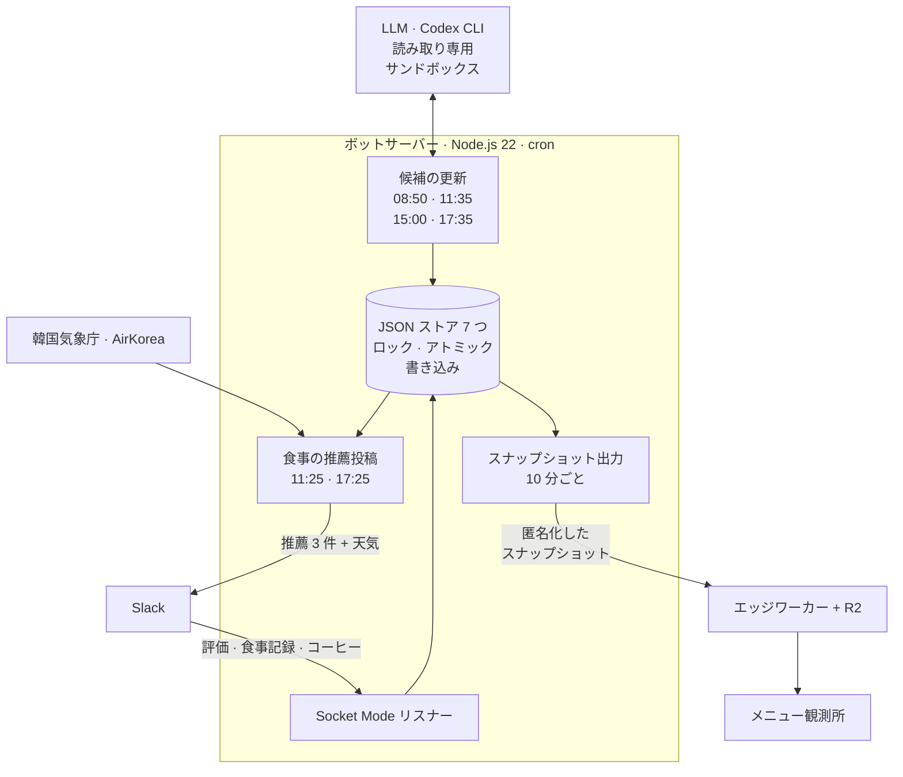

<div align="center">

[🇺🇸 English](README.md) · [🇨🇳 简体中文](README.zh-CN.md) · [🇭🇰 繁體中文](README.zh-HK.md) · **🇯🇵 日本語** · [🇰🇷 한국어](README.ko.md)


# Ojeommwo · 오점뭐

**今日のお昼、何食べる？** 大学の研究室に平日のランチとディナーを選ぶ Slack ボットと、<br>
すべての推薦をみんなの好みの銀河に変える 3D 観測所です。

[**観測所を開く**](https://ojeommwo-observatory.jumincho.chatgpt.site/) · [仕組み](#仕組み) · [ローカルで動かす](#ローカルで動かす)

</div>

## 概要

*Ojeommwo*（오점뭐）は、韓国語の「오늘 점심 뭐 먹지?」（今日のお昼、何食べる？）の略です。韓国・全州にある全北大学校のある研究室のために作られました。

平日の 11:25 と 17:25（韓国時間、祝日を除く）に、ボットが Slack にデリバリーのおすすめを 3 つ投稿します。研究室のメンバーがおすすめを評価し、実際に食べたものを記録すると、そのシグナルがベイズ型の好みモデルを更新し、次の推薦に反映されます。**メニュー観測所**は、その履歴全体を個人情報を除いた形で、飛び回って眺められる銀河として公開しています。

## 機能

### Slack ボット

- **1 食ごとに異なる 3 つの推薦。** カテゴリ・店・メニュー・主なたんぱく質がすべて異なります。同じ店は 14 日間、同じメニューは 7 日間は再び選ばれません。
- **検証済みの候補だけ。** 食事として適切か、実在する支店か、7 日以内に確認した価格と 3 日以内のデリバリーの根拠があるか、研究室の建物から 6 km 以内かを確認します。閉店やデリバリー停止が分かった候補は外します。デリバリーの根拠は、その支店が配達していることを示すもので、特定の住所に今注文できるかは注文アプリで確かめる必要があります。
- **19 の食事カテゴリ。** 한식、치킨、분식、돈까스、족발/보쌈、찜/탕、구이、피자、중식、일식、회/해물、양식、아시안、샌드위치、샐러드、버거、멕시칸、도시락、죽。飲み物・デザート・軽食のみのメニューは対象外で、食材よりもはっきりした料理の形式が優先されます。プルコギピザはあくまで 피자 です。
- **Slack 上でフィードバック。** 推薦メニューを 1〜5 点とタグ（最大 3 つ）で評価し、推薦外も含めて実際に食べたメニューを記録し、「あとでコーヒー行く人？」に参加できます。
- **公式の気象情報。** 韓国気象庁と AirKorea の 5 つのサービスから、研究室の建物を基準に現在・体感・最高・最低気温、湿度、降水、気象特報、紫外線、粒子状物質（PM10・PM2.5）を知らせます。
- **判断が要るところは LLM、それ以外はコード。** GPT-6 Luna（xhigh 推論、Codex CLI 経由）が新しい店をウェブで探し、大ざっぱに入力された食事記録を実在の支店とメニューに結び付け、曖昧なカテゴリをその支店のメニュー表を見ながら再審査します。読み取り専用のサンドボックスで動き、スキーマで検証した JSON だけを返し、データベースには書き込みません。順位付け・好みの計算・クールダウン・有効期限・重複排除・保存は、テスト済みの決定的なコードが担います。

### メニュー観測所

- **3D コスモス**（3D 코스모스）：カテゴリが光る中心となり、メニューはカテゴリ色の淡い光をまとった星としてその周りを巡ります。ドラッグで回転、ホイールで拡大、星をクリックすると詳細が開きます。名前が混み合うとカテゴリのラベルは消える代わりに中心の空いている側へ移り、星を少し外したクリックやタップでも最も近い星が選ばれます。
- **銀河の端のブラックホール。** 研究室の公式禁止メニューは好み −∞ として、GPU でリアルタイムにレイトレーシングされるブラックホールの中にあります。光はシュヴァルツシルト時空に沿って曲がります。降着円盤はこちらへ回ってくる側がより明るく輝き、円盤の奥の半分はシャドウの上下に曲がって見え、細い光子リングが縁をなぞり、背後の星の光もその周りで曲がります。ほかの星と同じようにクリックで開けます。
- **好みマップ**（취향 지도）：すべてのメニューを、カテゴリごとのレーン上の *苦手 0% · 中立 50% · 好き 100%* の軸に並べます。方向は文字・色・記号・模様で同時に示され、好み順のリスト表示にもすぐ切り替えられます。
- **フィルターと検索。** 複数のカテゴリを同時に選んだり、メニュー・店・主な食材で検索したりできます（例：`pork`）。
- **メニュー詳細。** 好み度、推薦された回数、食べた回数、評価数と平均、価格、デリバリーの確認状況を表示します。
- **メニューを眺める**（메뉴 둘러보기）：画面下にランダムなメニューが 5 つ並び、「다시 뽑기」（引き直す）で入れ替わります。
- **はじめからアクセシブル。** キーボード操作と好み順のリスト、回転・またたき・円盤の動きを止める「視差効果を減らす」設定、WebGL が使えない環境向けの代替表示に対応しています。GPU コンテキストが失われるとアニメーションを止め、ページは一度だけ読み込まれて自動で再読み込みされません。

観測所の画面は韓国語です。

## 仕組み


```mermaid
flowchart TB
  llm["LLM · Codex CLI<br/>読み取り専用<br/>サンドボックス"]
  weather["韓国気象庁 · AirKorea"]
  subgraph bot["ボットサーバー · Node.js 22 · cron"]
    refresh["候補の更新<br/>08:50 · 11:35<br/>15:00 · 17:35"]
    post["食事の推薦投稿<br/>11:25 · 17:25"]
    store[("JSON ストア 7 つ<br/>ロック · アトミック<br/>書き込み")]
    listener["Socket Mode リスナー"]
    export["スナップショット出力<br/>10 分ごと"]
  end
  slack["Slack"]
  edge["エッジワーカー + R2"]
  browser["メニュー観測所"]

  llm <--> refresh
  weather --> post
  refresh --> store
  store --> post
  post -->|"推薦 3 件 + 天気"| slack
  slack -->|"評価 · 食事記録 · コーヒー"| listener
  listener --> store
  store --> export
  export -->|"匿名化した<br/>スナップショット"| edge
  edge --> browser
```

- **投稿の前に候補を準備。** 調査と投稿は別のジョブです。毎食の前に価格・デリバリーの根拠・距離・クールダウン・多様性を再検証し、2 食分を用意しておきます。有効な 3 つが先に出ても、次の 3 つが残ります。準備が足りないときだけウェブを検索し、11:35 には新しい店を探す任意の探索をもう 1 回行います（店 2 軒、検索は最大 6 回、420 秒以内）。任意の探索が失敗しても、準備済みの候補はそのまま残ります。
- **検証した候補は捨てない。** すぐに使う候補リスト（active）は最大 12 件です。そこに入らなかった検証済みの候補はより大きなカタログに残り、順番に再検証されるので、リストが埋まっていたというだけで良い新しい店を失うことはありません。
- **根拠は正直に。** 支店の現在のメニュー表に明確な新価格があれば更新し、情報源どうしで価格が食い違えば保留します。距離はモデルの推測ではなく、その支店のページから読んだ座標で計算し、実際に訪れていないページは根拠として保存しません。閉店や支店の不一致はバックアップからも完全に取り除き、一時的なネットワークエラーではまだ有効な根拠を守ります。
- **好みモデル。** 各メニューは Beta(3, 3) の事前分布から始まるベータ事後分布を持ちます。実際の食事は 1.0、アンケートは 0.9 の重みで、根拠は半減期 180 日で弱まります。同じ人の繰り返し投票は抑えて反映します。同じ日は最新の 1 票だけ、異なる日は直近 3 日分を 1・0.5・0.25 倍で数えます。実際の食事は同じ日やそれ以前のアンケートに優先し、その後のアンケートはそのまま反映されながら、古い食事の影響を少しずつ弱めます。中立の 50% から、強い評価 1 件で約 57% に動き、同じ人が同じ日に 10 回評価しても 1 件として数え、異なる 10 人なら 80% まで動きます。
- **順位付け。** スコアは事後分布の平均 82% とランダムなベータ標本 18% を混ぜるので、いつも一番の好物だけが選ばれるわけではありません。根拠が十分で、研究室がまだ頼んだことのない店には 0.5 点の小さな加点がありますが、強い好み・配達距離のリスク・クールダウン・多様性が優先されます。結果は順位付けのシグナルであり、満足を保証するものではありません。
- **安全な保存。** 推薦履歴・配信の受領記録・食事・候補・アンケート・コーヒー・Slack outbox の 7 つの JSON ストアを、ロック・アトミックなリネーム・fsync・整合性チェックで扱います。Slack への送信は outbox を経由するため、結果が不確かな送信をむやみに繰り返しません。
- **実際の呼び出しで確かめる状態。** 毎朝 07:40 にモデルを実際に呼び出して応答を確かめ、ヘルスチェックはトークンの有効期限だけでなく直近の実際の呼び出し結果を報告します。Socket Mode の接続ごとに制限時間を設け、失敗した接続は再接続の前に片付けるので、止まったハンドシェイクが死んだリスナーや重複したリスナーを残しません。
- **観測所のパイプライン。** サーバーが 10 分ごとにデータベースを検証し、個人情報を除いたスナップショットを作って、R2 オブジェクトストレージを使うエッジワーカーに公開します。アップロードは分割して SHA-256 で検証し、R2 には条件付きで書き込むため、遅れて届いた再試行がより新しいスナップショットを上書きすることはありません。続くチェックで、公開 API が返すハッシュを照合します。ブラウザーはページを開いたときに最新のスナップショットを読み込みます。

## 技術スタック

| 構成 | 使用技術 |
| --- | --- |
| ボット | Node.js 22 以上（固定した依存は Undici 7.29.1 の 1 つだけ）、Slack Web API・Socket Mode、Codex CLI |
| データ | 韓国気象庁・AirKorea のオープン API、JSON ストア |
| 観測所 | Next.js 16、React 19、vinext（Vite 8）、TypeScript、three.js、3d-force-graph、ブラックホール用の GLSL レイトレーシングパス |
| ホスティング | R2 ストレージを使う Workers 型のエッジ関数、オフラインビューアーを兼ねる静的エクスポート |

## リポジトリ構成

```text
.
├── src/             Slack ボット：推薦器、候補の調査、好みモデル、天気、ストレージ
├── scripts/         運用 CLI：ヘルスチェック、監査、候補の更新、定時投稿
├── test/            ボットのテスト
├── prompts/         LLM の構造化出力用 JSON スキーマ
├── config/          店・メニューの正規化エイリアス
├── data/            初期メニューと祝日カレンダー（運用データは含まない）
└── observatory/     メニュー観測所
    ├── app/         React UI：3D コスモス、好みマップ、フィルター、詳細パネル、メニューを眺める
    ├── worker/      エッジワーカー：スナップショット API、公開時の認証、セキュリティヘッダー
    ├── scripts/     スナップショットの出力・検証・公開
    ├── tests/       観測所のテスト
    └── public/data/ ローカルプレビュー用の匿名化済みサンプルスナップショット
```

## ローカルで動かす

### 観測所（認証情報は不要）

Node.js 22.13 以降と Corepack が必要です。

```sh
cd observatory
corepack pnpm install --frozen-lockfile
corepack pnpm dev
```

開発サーバーが表示する URL を開いてください。スナップショット API がない場合は、`public/data/snapshot.json` のサンプルを代わりに読み込みます。

```sh
corepack pnpm lint
corepack pnpm typecheck
corepack pnpm test
```

テストは匿名化済みのサンプルと合成ストアを使うため、非公開の運用データベースなしで動きます。ボットの HTTP 通信モジュールを読み込むので、先にリポジトリのルートで `npm ci --omit=dev --ignore-scripts` を実行してください。Windows 専用のチェックと、実際の運用ストアが必要な統合チェック 1 件は、それ以外の環境ではスキップされます。

### ボット

Node.js 22 以降が必要です。

```sh
npm ci --omit=dev --ignore-scripts
npm run check   # 構文と JSON のチェック
npm test        # 単体テスト（Slack ワークスペースや認証情報は不要）
```

自分のワークスペースで動かすには、`.env.example` を `.env` にコピーし、Slack のボットトークンと Socket Mode 用のアプリレベルトークンを設定します。天気を使う場合は、韓国の公共データポータル（data.go.kr）のサービスキーも必要です。候補の調査には Codex CLI へのログインも必要です。`npm run dry-run` は推薦を作って表示するだけで、Slack には投稿しません。

## プライバシーとセキュリティ

- トークン、API キー、OAuth の状態、ログ、運用データベースはコミットしていません。秘密情報は `.env` とプロジェクト外の保護されたファイルにだけ置いています。
- 公開スナップショットに含まれるのは集計データだけです（メニュー、店、カテゴリ、好みの事後分布、件数）。Slack のユーザー ID、メッセージ、チャンネル情報は含まれず、公開前にバリデーターが禁止フィールドを拒否します。
- スナップショットの公開には Bearer トークンが必要です。それ以外の訪問者にとってサイトは読み取り専用で、厳格な Content Security Policy・HSTS・フレーム埋め込み防止ヘッダー付きで配信されます。
- 依存関係はロックファイルで固定し、勧告の無視リストを使わずに監査しています。

## ステータス

バージョン **2.0**（2.0.0）、2026-09-30 に正式リリース。リリース名は *GPT-6.1 Sol (max)* で、実際の運用モデルは xhigh 推論の GPT-6 Luna です。

2.0 の変更点：

- すぐに使う候補リストに入らなかった検証済みの候補をカタログに残し、再検証を経て推薦できるようにしました。
- 根拠が十分で、まだ頼んだことのない店に 0.5 点の小さな加点。
- Socket Mode の接続に制限時間を設け、エラー後に片付けることで、止まったハンドシェイクが死んだリスナーや重複したリスナーを残しません。
- ボットは Node に付属する古い版ではなく Undici 7.29.1 を固定して使い、観測所は Undici 7.29.1・fast-uri 3.1.8・brace-expansion 5.0.12 で依存関係の監査をクリアしました。
- 大きくなった 3D カテゴリラベル（24/25 px）は消える代わりに中心の空いている側へ移り、星はクリックやタップで選びやすくなり、好みマップの行の文字は 15 px になり、GPU コンテキストが失われるとアニメーションを止めます。

設計ドキュメント（韓国語）：[ARCHITECTURE.md](ARCHITECTURE.md) · [RELEASES.md](RELEASES.md) · [observatory/ARCHITECTURE.md](observatory/ARCHITECTURE.md) · [observatory/DESIGN.md](observatory/DESIGN.md)

## ライセンス

[MIT ライセンス](LICENSE) のもとで公開しています。
