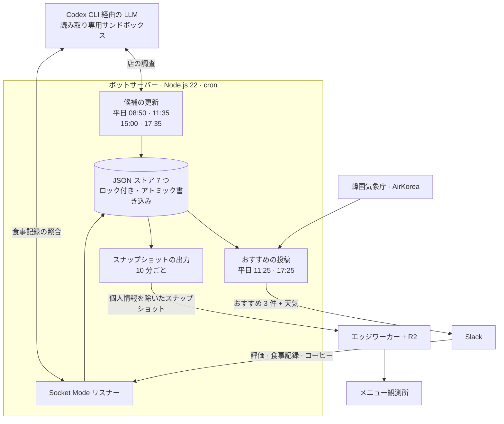

<div align="center">

[English](README.md) | [简体中文](README.zh-CN.md) | [繁體中文](README.zh-HK.md) | **日本語** | [한국어](README.ko.md)


# Ojeommwo · 오점뭐

**今日のお昼、何食べる？** 大学の研究室のために平日の昼食と夕食を選ぶ Slack ボットと、<br>
すべてのおすすめをみんなの好みの銀河に変える 3D 観測所です。

[**観測所を開く**](https://ojeommwo-observatory.jumincho.chatgpt.site/) · [仕組み](#仕組み) · [ローカルで動かす](#ローカルで動かす) · [リリース](https://github.com/jumincho/ojeommwo/releases)

</div>

## 概要

*Ojeommwo*（오점뭐）は、韓国語の問いかけ「오늘 점심 뭐 먹지?」（今日のお昼、何食べる？）の略です。韓国・全州の全北大学校（JBNU）にある研究室で使われています。

祝日を除く平日の 11:25 と 17:25（KST）に、ボットがデリバリーのおすすめ 3 件と天気を Slack に投稿します。研究室のメンバーはおすすめを評価し、実際に食べたものを記録します。そのシグナルでベイズ型の好みモデルが更新され、次回のおすすめに反映されます。**メニュー観測所**は、最近のおすすめと検証済みのすべてのメニューを、個人情報を除いた読み取り専用のビューとして、飛び回って眺められる銀河の形で公開しています。

## 機能

### Slack ボット

- **1 食ごとに異なる 3 件のおすすめ。** カテゴリ・店・メニュー・主なたんぱく質がすべて異なります。おすすめに出た店や実際に食べた店は 14 日間、メニューは 7 日間、再び選ばれません。
- **検証済みの候補だけ。** おすすめになるには、食事として適切で、実在する支店と一致し、直近 7 日以内に確認した価格と直近 3 日以内のデリバリーの根拠があり、研究室の建物から 6 km 以内（直線距離）にある必要があります。閉店やデリバリー停止が分かった候補は外します。デリバリーの根拠はその支店が配達していることを示すもので、自分の住所まで届くかどうかは、注文の確定時に注文アプリが確認します。
- **19 の食事カテゴリ。** 한식、치킨、분식、돈까스、족발/보쌈、찜/탕、구이、피자、중식、일식、회/해물、양식、아시안、샌드위치、샐러드、버거、멕시칸、도시락、죽。単品の飲み物・デザート・軽食は対象外で、食材よりもはっきりした料理の形式が優先されます。プルコギピザはあくまで 피자 です。
- **Slack 上でのフィードバック。** 食べたかどうかにかかわらず、おすすめされた各メニューがどれだけ魅力的かを 1〜5 で評価できます。おすすめ以外のメニューも含めて実際に食べたものを記録でき、任意で 1〜5 の評価とタグ（最大 3 つ）を付けられます。「あとでコーヒー行く人？」（이따 커피 마실 분?）の投票にも参加できます。
- **公式の気象情報。** 韓国気象庁の 3 つのサービスと AirKorea の 2 つのサービスで、研究室の所在地の天気を伝えます。現在の気温と体感温度、その日の最高・最低気温に加え、必要なときには降水確率、気象警報、高い湿度、強い紫外線、大気質の悪化も知らせます。
- **判断が要るところは LLM、それ以外はコード。** GPT-6 Luna（xhigh 推論、Codex CLI 経由）が新しい店をウェブで探し、自由に入力された食事記録を実在の支店とメニューに結び付け、曖昧なカテゴリをその支店自身のメニュー表と照らし合わせて判定し直します。読み取り専用のサンドボックスで動き、スキーマで検証した JSON を返し、データベースには一切書き込みません。順位付け・好みの計算・クールダウン・有効期限・重複排除・保存は、テスト済みの決定的なコードが担います。

### メニュー観測所

- **3D コスモス**（3D 코스모스）：カテゴリが光る中心となり、メニューはカテゴリ色の淡い光をまとった星としてその周りを巡ります。ドラッグで回転、スクロールで拡大・縮小でき、星をクリックすると詳細が開きます。「회전 끄기」（回転を止める）を押すと自動回転とまたたきが一時停止し、停止中も星をクリックできます。名前が混み合うと、カテゴリのラベルは消える代わりに中心の空いている側へ移ります。また、星から 12 px（タッチ操作では 22 px）以内であれば、少し外れたクリックでも最も近い星が選ばれます。
- **銀河の端のブラックホール。** 研究室で公式に禁止されているメニューは好み −∞ に位置し、GPU でリアルタイムにレイトレーシングされるブラックホールの中にあります。光はシュヴァルツシルト計量に従って曲がります。降着円盤はこちらへ回ってくる側がより明るく輝き、円盤の奥の半分はレンズ効果でシャドウの上下に回り込んで見え、細い光子リングが縁をなぞり、背後の星の光もその周りで曲がります。ほかの星と同じようにクリックできます。表示専用で、おすすめには一切影響しません。
- **好みマップ**（취향 지도）：すべてのメニューが、カテゴリごとに分かれたレーンの上で *苦手 0% · 中立 50% · 好き 100%* の軸に並びます。方向は文字・色・記号・模様を組み合わせて示し、順位付きリスト（목록）にはワンクリックで切り替えられます。
- **フィルターと検索。** 複数のカテゴリを同時に選んだり、メニュー・店・主な食材で検索したりできます。食材タグは英語と韓国語の 2 言語で付いているため、`pork` でも `돼지고기` でも同じメニューが見つかります。
- **メニュー詳細。** 好み度、おすすめされた回数、食べた回数、評価数と平均、価格、デリバリー情報の鮮度を表示します。
- **メニューを眺める**（메뉴 둘러보기）：画面下に、現在のフィルターに合うメニューからランダムに選んだ 5 つが並びます。「다시 뽑기」（引き直す）を押すと新しい組み合わせになります。
- **アクセシブルで誠実な表示。** 順位付きリストによるキーボード操作、システムの「視差効果を減らす」設定（回転・またたき・円盤の動きを止めます）と強制カラーのコントラストテーマへの対応、WebGL が使えない環境向けの代替表示を備えています。GPU コンテキストが失われるとアニメーションは止まります。ページはデータを一度だけ読み込み、ポーリングはしません。期限切れの価格やデリバリー情報は端末側のタイマーで消え、通信に失敗した場合は、ブラウザーに保存された最後の正常なデータをお知らせとともに表示します。

観測所の画面は韓国語です。

## 仕組み


```mermaid
flowchart TB
  llm["Codex CLI 経由の LLM<br/>読み取り専用サンドボックス"]
  weather["韓国気象庁 · AirKorea"]
  subgraph bot["ボットサーバー · Node.js 22 · cron"]
    refresh["候補の更新<br/>平日 08:50 · 11:35<br/>15:00 · 17:35"]
    post["おすすめの投稿<br/>平日 11:25 · 17:25"]
    store[("JSON ストア 7 つ<br/>ロック付き・アトミック書き込み")]
    listener["Socket Mode リスナー"]
    export["スナップショットの出力<br/>10 分ごと"]
  end
  slack["Slack"]
  edge["エッジワーカー + R2"]
  browser["メニュー観測所"]

  llm <-->|"店の調査"| refresh
  llm <-->|"食事記録の照合"| listener
  weather --> post
  refresh --> store
  store --> post
  post -->|"おすすめ 3 件 + 天気"| slack
  slack -->|"評価 · 食事記録 · コーヒー"| listener
  listener --> store
  store --> export
  export -->|"個人情報を除いたスナップショット"| edge
  edge --> browser
```

### おすすめ

- **投稿前に準備しておく候補。** 調査と投稿は別のジョブです。ボットは毎食の前に価格・デリバリーの根拠・距離・クールダウン・多様性を再検証し、2 食分の候補を確保しておきます。どの 3 件が先に送られても、有効なおすすめがさらに 3 件残ります。ウェブを検索するのは、この候補プールが足りなくなったときだけです。11:35 には、プールがすでに満たされている場合に限り、新しい店を最大 2 軒探すこともあります（モデルが使えるウェブ検索は 6 回までで、ジョブは 420 秒で打ち切られます）。この任意の探索が失敗しても、準備済みのプールはそのまま残ります。開始が 45 分を超えて遅れる投稿は、送らずにスキップします。
- **検証した候補は捨てない。** すぐに使う候補リスト（ショートリスト）は最大 12 件です。そこに入りきらない検証済みの候補は最大 120 件のカタログで待機し、12 件ずつ順番に再検証されるので、ショートリストが埋まっていたというだけで良い新しい店を失うことはありません。
- **正直な根拠の扱い。** 支店の現在のメニュー表に明確な新しい価格があれば古い価格を置き換え、情報源どうしで食い違う価格は保留します。距離はモデルの推測ではなく、その支店自身のページから読み取った座標で計算し、実際に訪れていないページは決して根拠として保存しません。閉店や支店の不一致が判明した候補はバックアップからも完全に削除しますが、一時的なネットワークエラーの場合は、まだ有効な根拠を残します。

### 好みモデルと順位付け

- **好みモデル。** 各メニューは Beta(3, 3) の事前分布から始まるベータ事後分布を持ちます。食事記録の重みは 1.0、アンケートの評価は 0.9 で（アンケートでは 2 と 4 は半分の重みで数え、3 は中立です）、根拠の重みは半減期 180 日で減衰します。1 票の影響は似たメニューにも及びます。別の店の同じメニューにはその約 78%、同じ店の別のメニューには約 56%、同じカテゴリのほかのメニューには約 11% が反映されます。
- **繰り返し投票の抑制。** 1 日のうちに数えるのは各自の最新の 1 票だけで、直近 3 日分はそれぞれ 1・0.5・0.25 の重みで数えます。食事記録は同じ日かそれ以前のアンケートより優先されます。その後のアンケートは引き続き反映され、古い食事記録のシグナルを少しずつ置き換えていきます。中立の 50% から、強い評価 1 件でメニューは約 57% に動きます。同じ人が同じ日に 10 回評価しても 1 回分としか数えず、異なる 10 人なら 80% まで動きます。
- **順位付け。** 各スコアは事後平均を 82%、ランダムなベータ標本を 18% の割合で混ぜたものなので、いちばんの好物が毎回選ばれるわけではありません。根拠が十分にあり、まだおすすめされたことも食べた記録もない店には 0.5 点のささやかなボーナス（強い 1 票分に満たない）が付きますが、それでも強い好み・配達距離のリスク・クールダウン・多様性が優先されます。観測所には安定した事後平均を表示し、ランダムな部分は順位付けにだけ影響します。結果は順位付けのシグナルであり、満足を約束するものではありません。

### 運用と公開

- **安全な保存。** 7 つの JSON ストア（おすすめ、配信の受領記録、食事、候補、アンケート、コーヒー、Slack の outbox）を、ロック・アトミックなリネーム・fsync・整合性チェックで扱います。Slack への送信は outbox を経由するため、結果が不確かな送信をむやみに繰り返すことはありません。おすすめの履歴は 90 日間、食事記録とアンケートの評価は 730 日間保存します。
- **実際の呼び出しに基づくヘルスチェック。** 毎朝 07:40 にモデルを実際に呼び出して LLM が応答するかを確かめ、ヘルスチェックはトークンの有効期限だけでなく、直近の実際の呼び出しの結果を報告します。Socket Mode の接続ごとに制限時間を設け、失敗した接続は再接続の前に片付けるので、止まったハンドシェイクが応答しないリスナーや重複したリスナーを残すことはありません。
- **観測所のパイプライン。** サーバーは 10 分ごとにデータベースを検証し、個人情報を除いたスナップショットを出力して、R2 オブジェクトストレージを使うエッジワーカーに公開します。アップロードはチャンクに分けて SHA-256 でハッシュ化し、R2 への書き込みは条件付きで行うため、遅れて届いた再試行がより新しいスナップショットを上書きすることはありません。その後の確認で、公開 API が返すハッシュを照合します。ブラウザーはページを開いたときに最新のスナップショットを一度だけ読み込みます。制限時間は API が 10 秒、静的データへのフォールバックが 5 秒です。

## 技術スタック

| 構成 | 使用技術 |
| --- | --- |
| ボット | Node.js 22 以上（固定した依存関係は Undici 7.29.1 の 1 つだけ）、Slack Web API・Socket Mode、Codex CLI |
| データ | 韓国気象庁と AirKorea のオープン API、7 つの JSON ストア |
| 観測所 | Next.js 16、React 19、vinext（Vite 8）、TypeScript、three.js、3d-force-graph、ブラックホール用の GLSL レイトレーシングパス |
| ホスティング | Sites：R2 ストレージを使う Workers 型のエッジ関数。静的エクスポートは、ループバック専用の非常用ビューアーも兼ねます |

## リポジトリ構成

```text
.
├── src/             Slack ボット：おすすめエンジン、候補の調査、好みモデル、天気、ストレージ
├── scripts/         運用 CLI：ヘルスチェック、監査、候補の更新、定時投稿
├── test/            ボットのテストスイート
├── prompts/         LLM の構造化出力用 JSON スキーマ
├── config/          食事記録の正規化に使う店・メニューのエイリアス
├── data/            初期メニューと祝日カレンダー（運用データなし）
└── observatory/     メニュー観測所
    ├── app/         React UI：3D コスモス、好みマップ、フィルター、詳細パネル、メニューを眺める
    ├── worker/      エッジワーカー：スナップショット API、公開時の認証、セキュリティヘッダー
    ├── build/       Sites のデプロイメタデータ用 Vite プラグイン
    ├── scripts/     スナップショットの出力・検証・公開、非常用ビューアー
    ├── tests/       観測所のテスト
    └── public/data/ ローカルプレビュー用の、個人情報を除いたサンプルスナップショット
```

## ローカルで動かす

### 観測所（認証情報は不要）

Node.js 22.13 以降が必要です。Corepack は Node.js 22 と 24 に同梱されています。Node.js 25 以降では、先に `npm install -g corepack` でインストールしてください。

```sh
cd observatory
corepack pnpm install --frozen-lockfile
corepack pnpm dev
```

開発サーバーが表示する URL を開いてください。スナップショット API がない場合、アプリは `public/data/snapshot.json` のサンプルを代わりに読み込みます。

```sh
corepack pnpm lint
corepack pnpm typecheck
corepack pnpm test
```

テストは個人情報を除いたサンプルと合成ストアを使うため、非公開の運用データベースがなくても動きます。テストはボット自身のモジュールを読み込み、それらが固定バージョンの Undici を読み込むので、先にリポジトリのルートで `npm ci --omit=dev --ignore-scripts` を実行してください。Windows 専用のチェックと、実際のストアが必要な統合チェック 1 件は、ほかの環境ではスキップされます。

### ボット

Node.js 22 以降が必要です。

```sh
npm ci --omit=dev --ignore-scripts
npm run check   # 構文と JSON のチェック
npm test        # 単体テスト（Slack ワークスペースや認証情報は不要）
```

Slack を使わずにおすすめを確認するには、同梱の初期メニューからおすすめを 3 件表示します。

```sh
cp .env.example .env
RECOMMENDATION_MODE=static npm run dry-run
```

自分のワークスペースでボットを動かす手順は次のとおりです。

- 自分のチャンネル ID を `src/config.js`（`REQUIRED_LUNCH_CHANNEL_ID`、`REQUIRED_OPERATOR_DM_CHANNEL_ID`）と `.env` に設定します。このコピーにはプレースホルダーが入っています。
- `channels:read` と `chat:write` のスコープを持つボットトークンと、Socket Mode 用のアプリレベルトークンを追加します。評価・食事記録・コーヒーの投票を使うには `ENABLE_MEAL_FEEDBACK=true` を設定します。
- 天気を使うには、`WEATHER_ENABLED=true` と、5 つのサービスすべてで承認された data.go.kr のサービスキーを設定します。
- 候補の調査には、プロジェクトの外かつ `~/.codex` の外に保存した、専用の Codex CLI ログイン情報が必要です。
- `npm start` で Socket Mode リスナーが起動します。投稿と候補の更新は Asia/Seoul 時間の cron から実行され（`scripts/pororo-crontab.txt` を参照）、組み込みのスケジューラーはオフのままです。`data/holiday-skip-dates.json` が対象としていない年には定時投稿がエラーで止まります。現在の対象は 2026〜2027 年です。

## プライバシーとセキュリティ

- トークン、API キー、OAuth の状態、ログ、運用データベースはコミットしていません。秘密情報は `.env` と、プロジェクト外の保護されたファイルに置いています。
- 公開スナップショットには個人単位のデータは含まれません。含まれるのは、メニュー、店、カテゴリ、価格と根拠の鮮度、好みの事後分布、件数、投稿したおすすめの時系列です。住所、座標、根拠の URL、Slack のユーザー・チャンネル・メッセージの識別子のいずれかが含まれていれば、公開前にバリデーターが拒否します。
- スナップショットの公開には Bearer トークンが必要です。それ以外の人にとってサイトは読み取り専用で、厳格な Content Security Policy、HSTS、フレーム埋め込み防止のヘッダー付きで配信されます。
- 依存関係はロックファイルで固定し、セキュリティアドバイザリの除外リストを使わずに監査しています。

## ステータス

バージョン **2.5**（2.5.0）、2026-10-03 リリース（[リリースノート](https://github.com/jumincho/ojeommwo/releases/tag/v2.5.0)）。リリース表記は *GPT-6 Astra Ultra* で、実行時のモデルは引き続き xhigh 推論の GPT-6 Luna です。

- 定時投稿の安全策と個人 DM の分離で、みんなで共有する食事履歴と好みを守ります。
- 検証済みのカタログのメニューを過去の好みと並べて表示し、読み込みには時間制限を設け、価格とデリバリーの根拠の有効期限を正しく反映します。
- 現在の韓国語の表記と機能はそのままに、3D と好みマップの読みやすさと選択操作を改善しました。
- 固定した依存関係、モデル認証、韓国の気象情報（韓国気象庁・AirKorea）、運用データ、緊急運用の安全策を点検しました。検証した範囲は [QUALITY_REPORT.md](QUALITY_REPORT.md) を参照してください。
- フロントエンドと README の改善作業は、後日 Claude Opus 5 Ultracode が行う予定です。

設計とリリースの文書：[ARCHITECTURE.md](ARCHITECTURE.md) · [RELEASES.md](RELEASES.md) · [QUALITY_REPORT.md](QUALITY_REPORT.md) · [MODEL_EVALUATION.md](MODEL_EVALUATION.md) · [observatory/DESIGN.md](observatory/DESIGN.md)（韓国語）

## ライセンス

[MIT ライセンス](LICENSE)のもとで公開しています。
