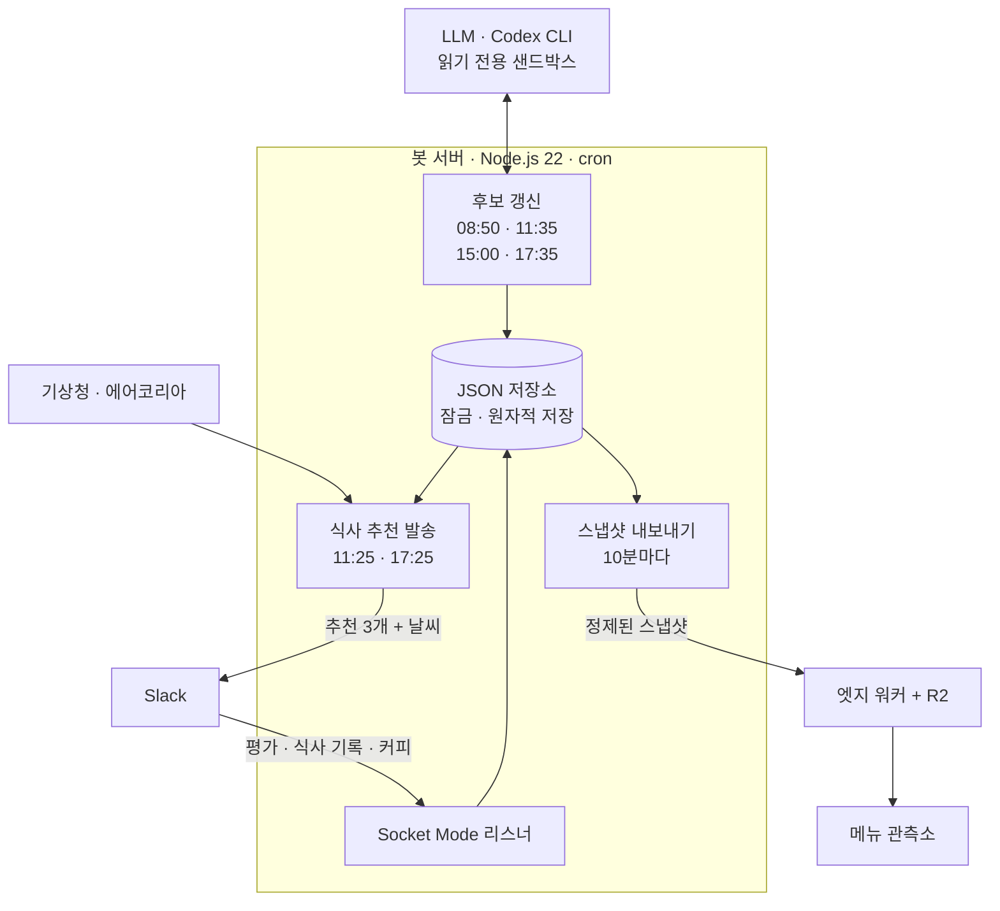

<div align="center">

[🇺🇸 English](README.md) · [🇨🇳 简体中文](README.zh-CN.md) · [🇭🇰 繁體中文](README.zh-HK.md) · [🇯🇵 日本語](README.ja.md) · **🇰🇷 한국어**


# 오점뭐 · Ojeommwo

**오늘 점심 뭐 먹지?** 연구실의 평일 점심·저녁 배달 메뉴를 골라 주는 Slack 봇,<br>
그리고 모든 추천을 함께 쌓아 온 취향의 지도로 보여 주는 3D 메뉴 관측소입니다.

[**메뉴 관측소 열기**](https://ojeommwo-observatory.jumincho.chatgpt.site/) · [동작 방식](#동작-방식) · [로컬에서 실행하기](#로컬에서-실행하기)

</div>

## 소개

**오점뭐**는 “오늘 점심 뭐 먹지?”의 줄임말입니다. 전주에 있는 전북대학교의 한 연구실을 위해 만들었습니다.

평일 11:25와 17:25(KST)에 봇이 Slack에 배달 메뉴 세 가지를 올립니다. 공휴일은 건너뛰며, 세 메뉴는 카테고리·식당·메뉴가 모두 다릅니다. 연구실 사람들이 추천을 평가하고 실제로 먹은 메뉴를 기록하면, 그 신호가 베이지안 취향 모델을 갱신해 다음 추천에 반영됩니다. **메뉴 관측소**는 그 모든 기록을 개인정보를 뺀 형태로 공개합니다.

## 주요 기능

### Slack 봇

- **끼니마다 서로 다른 세 가지 추천.** 카테고리·식당·메뉴가 매번 겹치지 않습니다. 같은 식당은 14일, 같은 메뉴는 7일 동안 다시 나오지 않습니다.
- **검증된 후보만 추천.** 식사로 적합한지, 실제 지점인지, 7일 안에 확인한 가격과 3일 안의 배달 근거가 있는지, 반경 6km 안인지 확인합니다. 폐점이나 배달 중단이 확인되면 후보에서 뺍니다.
- **19개 식사 카테고리.** 한식, 치킨, 분식, 돈까스, 족발/보쌈, 찜/탕, 구이, 피자, 중식, 일식, 회/해물, 양식, 아시안, 샌드위치, 샐러드, 버거, 멕시칸, 도시락, 죽. 음료·디저트·간식 단독 메뉴는 제외합니다.
- **Slack에서 바로 피드백.** 추천 메뉴를 1~5점과 태그(최대 3개)로 평가하고, 추천되지 않은 메뉴까지 먹은 메뉴를 기록하고, “이따 커피 마실 분?”에 참여할 수 있습니다.
- **공식 날씨 정보.** 기상청과 에어코리아 데이터로 현재·체감·최고·최저 기온, 습도, 강수, 기상특보, 자외선, 미세먼지를 알려 줍니다.
- **판단이 필요한 곳엔 LLM, 나머지는 코드.** GPT-6 Luna(xhigh 추론, Codex CLI 경유)가 새 후보를 웹에서 조사하고, 대충 입력한 식사 기록을 정규화하고, 애매한 카테고리를 재심사합니다. 읽기 전용 샌드박스에서 스키마로 검증한 JSON만 돌려줍니다. 순위·선호 계산·유효기간·중복 처리·저장은 테스트된 결정론적 코드가 맡습니다.

### 메뉴 관측소

- **3D 코스모스**: 카테고리는 빛나는 중심이 되고, 메뉴는 그 주위를 도는 별이 됩니다. 드래그로 회전하고 휠로 확대하며, 별을 누르면 상세 정보가 열립니다.
- **취향 지도**: 모든 메뉴를 카테고리별 줄 위의 *비선호 0% · 중립 50% · 선호 100%* 축에 놓습니다. 방향은 글자·색·기호·무늬로 함께 구분하며, 선호 순 목록으로 바로 바꿔 볼 수 있습니다.
- **필터와 검색.** 카테고리를 여러 개 고르거나, 메뉴·상호·주재료로 검색합니다(예: `pork`).
- **메뉴 상세.** 선호도, 추천된 횟수, 먹은 횟수, 평가 수와 평균, 가격, 배달 확인 상태를 보여 줍니다.
- **메뉴 둘러보기**: 하단에 무작위 메뉴 다섯 개가 나오고, ‘다시 뽑기’로 새로 뽑습니다.
- **기본으로 갖춘 접근성.** 키보드 탐색, 동작 줄이기 설정, WebGL을 쓸 수 없는 환경의 대체 화면을 지원합니다. 페이지는 한 번만 불러오며 스스로 새로고침하지 않습니다.

## 동작 방식



- **발송 전에 후보를 준비합니다.** 검색과 발송이 서로 다른 작업이라, 검색이 실패해도 발송은 실패하지 않습니다. 끼니마다 가격·배달 근거·거리·쿨다운·다양성을 다시 검증하고, 검증된 후보가 모자랄 때만 웹을 검색합니다. 11:35에는 새 식당을 찾는 선택적 탐색을 한 번 더 합니다.
- **취향 모델.** 메뉴마다 Beta(3, 3) 사전분포에서 시작하는 베타 사후분포를 둡니다. 실제 식사는 1.0, 설문은 0.9의 가중치를 가지며, 근거는 반감기 180일로 약해지고, 탐색 비율 18%로 새로운 선택지를 섞습니다. 한 사람의 반복 투표는 줄여서 반영합니다. 같은 날에는 최신 한 건만, 서로 다른 날은 최근 3일을 1 · 0.5 · 0.25배로 셉니다. 결과는 순위를 매기는 신호일 뿐, 만족을 보장하지 않습니다.
- **안전한 저장.** 잠금·원자적 교체·fsync·무결성 검사를 거치는 JSON 파일을 씁니다. Slack 전송은 outbox를 거치므로, 결과가 불확실한 전송을 무작정 다시 보내지 않습니다.
- **관측소 파이프라인.** 서버가 10분마다 DB를 검증하고, 개인정보를 뺀 스냅샷을 만들어 R2 저장소를 쓰는 엣지 워커에 게시합니다. 브라우저는 페이지를 열 때 최신 스냅샷을 읽습니다.

## 기술 스택

| 구성 | 사용 기술 |
| --- | --- |
| 봇 | Node.js 22 이상(npm 의존성 없음), Slack Web API·Socket Mode, Codex CLI |
| 데이터 | 기상청·에어코리아 공공 API, JSON 저장소 |
| 관측소 | Next.js 16, React 19, vinext(Vite 8), TypeScript, three.js, 3d-force-graph |
| 호스팅 | R2 저장소를 쓰는 Workers 방식 엣지 함수, 오프라인 뷰어를 겸하는 정적 내보내기 |

## 저장소 구조

```text
.
├── src/             Slack 봇: 추천기, 후보 조사, 취향 모델, 날씨, 저장소
├── scripts/         운영 CLI: 상태 점검, 감사, 후보 갱신, 예약 발송
├── test/            봇 테스트
├── prompts/         LLM 구조화 출력용 JSON 스키마
├── config/          식당·메뉴 정규화 별칭
├── data/            초기 메뉴와 공휴일 달력 (운영 데이터 아님)
└── observatory/     메뉴 관측소
    ├── app/         React UI: 3D 코스모스, 취향 지도, 필터, 상세 패널, 둘러보기
    ├── worker/      엣지 워커: 스냅샷 API, 게시 인증, 보안 헤더
    ├── scripts/     스냅샷 내보내기·검증·게시
    ├── tests/       관측소 테스트
    └── public/data/ 로컬 미리보기용 정제된 샘플 스냅샷
```

## 로컬에서 실행하기

### 관측소 (인증 정보 불필요)

Node.js 22.13 이상과 Corepack이 필요합니다.

```sh
cd observatory
corepack pnpm install --frozen-lockfile
corepack pnpm dev
```

개발 서버가 알려 주는 주소를 여세요. 스냅샷 API가 없으면 `public/data/snapshot.json`의 샘플을 대신 불러옵니다.

```sh
corepack pnpm lint
corepack pnpm typecheck
```

`corepack pnpm test`도 실행되지만, 일부 테스트는 이 저장소에 없는 운영 DB로 스냅샷을 다시 만들기 때문에 여기서는 실패합니다.

### 봇

Node.js 22 이상이 필요합니다.

```sh
npm run check   # 문법·JSON 검사
npm test        # 단위 테스트, Slack 워크스페이스나 인증 정보 불필요
```

자신의 워크스페이스에서 실행하려면 `.env.example`을 `.env`로 복사한 뒤 Slack 봇 토큰과 Socket Mode용 앱 수준 토큰을 넣고, 날씨가 필요하면 공공데이터포털(data.go.kr) 서비스 키도 넣으세요. 후보 조사에는 Codex CLI 로그인이 필요합니다. `npm run dry-run`은 추천을 만들어 출력만 하고 Slack에 올리지 않습니다.

## 개인정보와 보안

- 토큰, API 키, OAuth 상태, 로그, 운영 DB는 커밋하지 않습니다. 비밀값은 `.env`와 프로젝트 밖의 보호된 파일에만 둡니다.
- 공개 스냅샷에는 메뉴·식당·카테고리·선호 사후분포·집계 수치만 들어 있습니다. Slack 사용자 ID, 메시지, 채널 정보는 없으며, 게시 전에 검증기가 금지된 필드를 거부합니다.
- 스냅샷 게시에는 Bearer 토큰이 필요합니다. 다른 모든 방문자에게 사이트는 읽기 전용이며, 엄격한 CSP·HSTS·프레임 차단 헤더와 함께 제공됩니다.

## 현황

버전 **2.6**, 2026-09-23 정식 출범. 릴리즈 표기는 *GPT-6 Sol Max (Daybreak Blue)*, 실제 운영 모델은 xhigh 추론의 GPT-6 Luna입니다.

설계 문서: [ARCHITECTURE.md](ARCHITECTURE.md) · [RELEASES.md](RELEASES.md) · [observatory/ARCHITECTURE.md](observatory/ARCHITECTURE.md) · [observatory/DESIGN.md](observatory/DESIGN.md)
