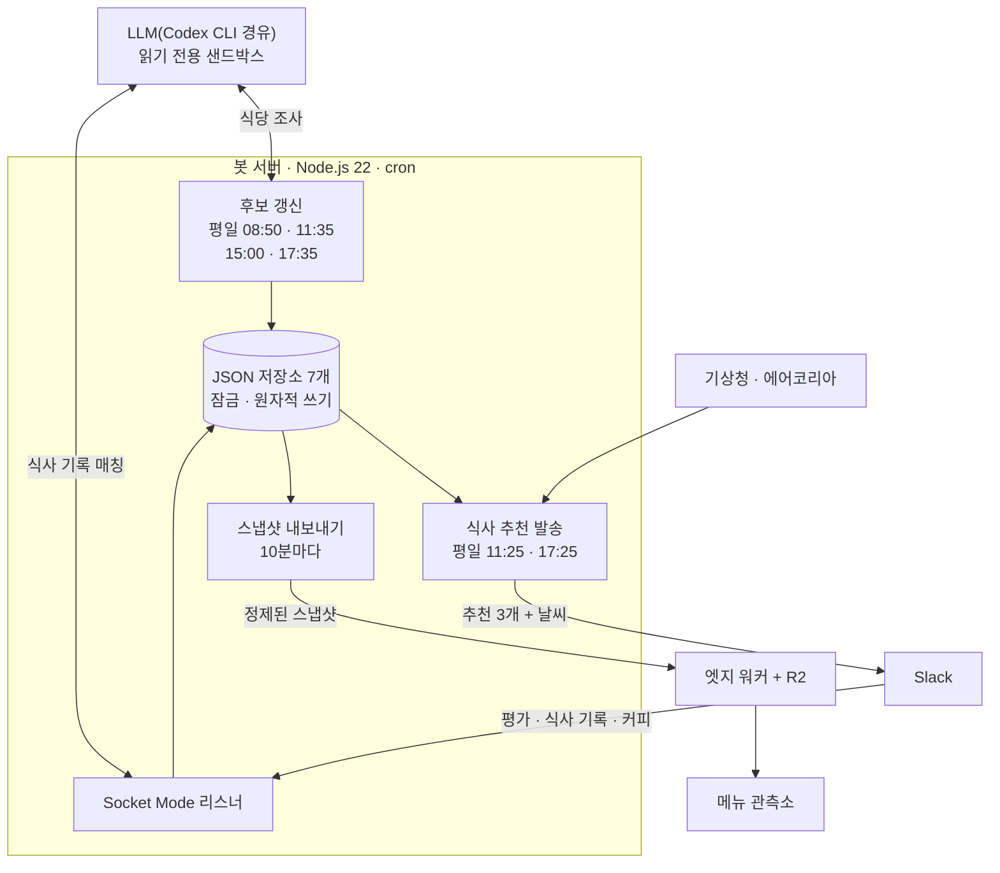

<div align="center">

[English](README.md) | [简体中文](README.zh-CN.md) | [繁體中文](README.zh-HK.md) | [日本語](README.ja.md) | **한국어**


# 오점뭐 · Ojeommwo

**오늘 점심 뭐 먹지?** 대학 연구실의 평일 점심과 저녁 메뉴를 골라 주는 Slack 봇,<br>
그리고 모든 추천을 함께 나눈 취향의 은하로 바꿔 보여 주는 3D 관측소입니다.

[**메뉴 관측소 열기**](https://ojeommwo-observatory.jumincho.chatgpt.site/) · [동작 방식](#동작-방식) · [로컬에서 실행하기](#로컬에서-실행하기) · [릴리스](https://github.com/jumincho/ojeommwo/releases)

</div>

## 소개

**오점뭐**(Ojeommwo)는 “오늘 점심 뭐 먹지?”를 줄인 말입니다. 대한민국 전주에 있는 전북대학교(JBNU)의 한 연구실에서 쓰고 있습니다.

봇은 공휴일을 제외한 평일 11:25과 17:25(KST)에 배달 메뉴 세 가지와 날씨를 Slack에 올립니다. 연구실 구성원은 추천을 평가하고 실제로 먹은 메뉴를 기록합니다. 이 신호로 베이지안 취향 모델을 갱신해 다음 추천에 반영합니다. **메뉴 관측소**는 최근 추천과 검증된 모든 메뉴를 직접 날아다니며 둘러볼 수 있는 은하로 펼쳐, 민감한 정보를 걸러 낸 읽기 전용 화면으로 공개합니다.

## 주요 기능

### Slack 봇

- **끼니마다 서로 다른 세 가지 추천.** 카테고리·식당·메뉴·주요 단백질이 모두 다릅니다. 추천되었거나 먹은 식당은 14일 동안, 메뉴는 7일 동안 다시 나오지 않습니다.
- **검증된 후보만 추천.** 추천 메뉴는 식사로 알맞고, 실제 지점과 일치하며, 최근 7일 안에 확인한 가격과 최근 3일 안의 배달 근거가 있고, 연구실 건물에서 직선거리로 6 km 이내여야 합니다. 폐점했거나 배달을 멈춘 곳은 후보에서 빠집니다. 배달 근거는 그 지점이 배달을 한다는 뜻이며, 내 주소까지 배달되는지는 주문 앱에서 결제할 때 확인해야 합니다.
- **19개 식사 카테고리.** 메뉴는 한식, 치킨, 분식, 돈까스, 족발/보쌈, 찜/탕, 구이, 피자, 중식, 일식, 회/해물, 양식, 아시안, 샌드위치, 샐러드, 버거, 멕시칸, 도시락, 죽으로 나뉩니다. 음료·디저트·간식 단독 메뉴는 제외하며, 재료보다 분명한 음식 형태가 우선합니다. 불고기 피자는 여전히 피자입니다.
- **Slack에서 바로 피드백.** 실제로 먹었는지와 관계없이 추천 메뉴마다 얼마나 끌리는지 1~5점으로 평가할 수 있습니다. 추천받지 않은 메뉴를 포함해 실제로 먹은 메뉴를 기록하고, 원하면 1~5점 평가와 최대 세 개의 태그도 붙일 수 있습니다. “이따 커피 마실 분?” 투표에도 답할 수 있습니다.
- **공식 날씨 정보.** 기상청 서비스 세 개와 에어코리아 서비스 두 개로 연구실 위치의 날씨를 다룹니다. 현재 기온과 체감 온도, 그날의 최고·최저 기온을 보여 주고, 필요할 때는 강수 확률, 기상특보, 높은 습도, 강한 자외선, 나쁜 대기질도 함께 알려 줍니다.
- **판단이 도움이 되는 곳에는 LLM, 나머지는 모두 코드.** GPT-6 Luna(xhigh 추론, Codex CLI 경유)가 웹에서 새 식당을 찾고, 자유롭게 입력한 식사 기록을 실제 지점·메뉴에 연결하고, 애매한 카테고리를 그 지점의 메뉴판과 대조해 다시 판정합니다. 읽기 전용 샌드박스에서 실행되고, 스키마로 검증한 JSON을 돌려주며, 데이터베이스에는 절대 쓰지 않습니다. 순위, 선호도 계산, 쿨다운, 만료, 중복 제거, 저장은 테스트를 거친 결정론적 코드가 맡습니다.

### 메뉴 관측소

- **3D 코스모스**: 카테고리는 빛나는 중심이 되고, 메뉴는 카테고리 색의 은은한 빛을 두른 별이 되어 그 주위를 돕니다. 드래그하면 회전하고, 스크롤하면 확대·축소되며, 별을 누르면 상세 정보가 열립니다. ‘회전 끄기’를 누르면 자동 회전과 반짝임이 멈추며, 멈춘 동안에도 별을 누를 수 있습니다. 이름이 빽빽하게 몰리면 카테고리 라벨이 사라지는 대신 중심 주위의 빈 쪽으로 옮겨 가고, 별을 살짝 빗나가도 12 px(터치는 22 px) 안이면 가장 가까운 별이 선택됩니다.
- **은하 가장자리의 블랙홀.** 연구실의 공식 금지 메뉴는 취향 −∞에 해당하며, GPU에서 실시간 광선 추적으로 그리는 블랙홀 안에 놓여 있습니다. 빛은 슈바르츠실트 계량을 따라 휩니다. 강착 원반은 보는 사람 쪽으로 회전해 오는 쪽이 더 밝게 타오르고, 원반의 먼 쪽 절반은 렌즈 효과로 그림자 위아래에 휘어 보이며, 얇은 광자 고리가 가장자리를 두르고, 뒤편의 별들도 그 주위로 휘어 보입니다. 다른 별처럼 눌러 볼 수 있습니다. 표시용일 뿐 추천에는 전혀 영향을 주지 않습니다.
- **취향 지도**: 모든 메뉴가 카테고리별로 한 줄씩 나뉜 *비선호 0% · 중립 50% · 선호 100%* 축 위에 놓입니다. 방향은 글자·색·기호·무늬로 함께 보여 주며, 클릭 한 번이면 선호 순 ‘목록’으로 바꿔 볼 수 있습니다.
- **필터와 검색.** 카테고리를 한 번에 여러 개 고르거나, 메뉴·식당·주재료로 검색할 수 있습니다. 재료 태그는 한국어와 영어를 함께 쓰므로 `돼지고기`로 검색하든 `pork`로 검색하든 같은 메뉴가 나옵니다.
- **메뉴 상세.** 선호도, 추천된 횟수, 먹은 횟수, 평가 수와 평균, 가격, 배달 근거의 확인 시점을 보여 줍니다.
- **메뉴 둘러보기**: 현재 필터에 맞는 메뉴 다섯 개를 무작위로 골라 하단에 보여 주며, ‘다시 뽑기’를 누르면 새로 뽑습니다.
- **접근성과 정직한 정보.** 선호 순 목록을 갖춘 키보드 탐색, 시스템의 동작 줄이기 설정(회전·반짝임·원반의 움직임을 멈춥니다)과 강제 색상 대비 테마 지원, WebGL을 쓸 수 없을 때의 대체 화면을 갖췄습니다. GPU 컨텍스트를 잃으면 애니메이션을 멈춥니다. 페이지는 데이터를 한 번만 불러오고 주기적으로 다시 요청하지 않습니다. 만료된 가격과 배달 근거는 브라우저 안의 타이머에 따라 사라지고, 네트워크가 실패하면 브라우저에 저장해 둔 마지막 정상 사본을 안내와 함께 보여 줍니다.

관측소 화면은 한국어로 되어 있습니다.

## 동작 방식


```mermaid
flowchart TB
  llm["LLM(Codex CLI 경유)<br/>읽기 전용 샌드박스"]
  weather["기상청 · 에어코리아"]
  subgraph bot["봇 서버 · Node.js 22 · cron"]
    refresh["후보 갱신<br/>평일 08:50 · 11:35<br/>15:00 · 17:35"]
    post["식사 추천 발송<br/>평일 11:25 · 17:25"]
    store[("JSON 저장소 7개<br/>잠금 · 원자적 쓰기")]
    listener["Socket Mode 리스너"]
    export["스냅샷 내보내기<br/>10분마다"]
  end
  slack["Slack"]
  edge["엣지 워커 + R2"]
  browser["메뉴 관측소"]

  llm <-->|"식당 조사"| refresh
  llm <-->|"식사 기록 매칭"| listener
  weather --> post
  refresh --> store
  store --> post
  post -->|"추천 3개 + 날씨"| slack
  slack -->|"평가 · 식사 기록 · 커피"| listener
  listener --> store
  store --> export
  export -->|"정제된 스냅샷"| edge
  edge --> browser
```

### 추천

- **발송 전에 후보를 준비합니다.** 후보 조사와 발송은 별개의 작업입니다. 봇은 매 끼니 전에 가격·배달 근거·거리·쿨다운·다양성을 다시 검증하고 두 끼에 쓸 서로 독립적인 3개짜리 추천 묶음 두 세트를 목표로 준비합니다. 08:50~09:10의 아침 예외 구간에는 두 세트를 확보하지 못해도 다시 검증한 한 세트로 점심 발송을 준비할 수 있으며, 이후 갱신에서 예비 후보를 보충합니다. 웹 검색은 이 후보군이 모자랄 때만 합니다. 11:35에는 후보군이 이미 꽉 찬 경우에만 새 식당을 최대 두 곳까지 더 찾아볼 수 있습니다(모델의 웹 검색 한도는 여섯 번이고, 작업은 420초가 지나면 멈춥니다). 이 선택적 탐색이 실패해도 준비된 후보군은 그대로 남습니다. 발송이 45분 넘게 늦게 시작될 상황이면 보내지 않고 건너뜁니다.
- **검증한 후보는 버리지 않습니다.** 당장 쓰는 후보 목록에는 최대 12개가 들어갑니다. 여기에 들지 못한 검증된 후보는 최대 120개까지 담는 카탈로그에서 기다리며 12개씩 차례로 재검증되므로, 목록이 꽉 찼다는 이유만으로 좋은 새 식당을 놓치지 않습니다.
- **근거는 정직하게 다룹니다.** 지점의 현재 메뉴판에 명확한 새 가격이 있으면 기존 가격을 바꾸고, 출처마다 가격이 다르면 반영을 보류합니다. 거리는 모델의 추측이 아니라 해당 지점 페이지에서 읽은 좌표로 계산하며, 실제로 방문하지 않은 페이지는 근거로 저장하지 않습니다. 폐점이나 지점 불일치는 백업에서까지 완전히 지우고, 일시적인 네트워크 오류가 나도 아직 유효한 근거는 지킵니다.

### 취향 모델과 순위

- **취향 모델.** 메뉴마다 Beta(3, 3) 사전분포에서 시작하는 베타 사후분포를 둡니다. 식사 기록은 1.0, 설문 평가는 0.9의 가중치를 가지며(설문에서 2점이나 4점은 절반만, 3점은 중립으로 셉니다), 근거는 180일 반감기로 약해집니다. 한 표는 비슷한 메뉴에도 전해집니다. 다른 식당의 같은 메뉴에는 약 78%, 같은 식당의 다른 메뉴에는 약 56%, 같은 카테고리의 다른 메뉴에는 약 11%가 반영됩니다.
- **반복 투표는 줄여서 반영합니다.** 하루 안에서는 한 사람의 마지막 투표만 세고, 그 사람이 투표한 날 가운데 최근 3일은 각각 1, 0.5, 0.25배로 셉니다. 식사 기록은 같은 날이나 그 이전의 설문을 대신하며, 이후의 설문은 그대로 반영되면서 오래된 식사 신호를 차츰 밀어냅니다. 중립 50%에서 강한 평가 한 건은 메뉴를 약 57%로 움직이고, 같은 사람이 같은 날 열 번 평가해도 한 번으로 세며, 서로 다른 열 명이면 80%까지 움직입니다.
- **순위.** 각 점수는 사후분포 평균 82%와 무작위 베타 표본 18%를 섞으므로, 가장 좋아하는 메뉴가 매번 뽑히지는 않습니다. 근거가 충분한데 아직 추천되거나 먹은 기록이 없는 식당에는 0.5점의 작은 가점(강한 투표 한 건보다 작음)을 주지만, 강한 선호·배달 거리 위험·쿨다운·다양성이 여전히 우선합니다. 관측소는 안정적인 사후분포 평균을 보여 주며, 무작위 부분은 순위에만 영향을 줍니다. 결과는 순위를 매기는 신호일 뿐, 만족을 보장하지 않습니다.

### 운영과 게시

- **안전한 저장.** 추천·발송 영수증·식사·후보·설문·커피·Slack 발신함(outbox)의 JSON 저장소 7개를 잠금·원자적 이름 바꾸기·fsync·무결성 검사로 다룹니다. Slack 전송은 발신함을 거치므로, 결과가 불확실한 전송을 무작정 반복하지 않습니다. 추천 이력은 90일, 식사 기록과 설문 평가는 730일 동안 보관합니다.
- **실제 호출로 확인하는 상태.** 매일 아침 07:40에 모델을 실제로 호출해 LLM이 응답하는지 확인하며, 상태 점검은 토큰 만료일만이 아니라 가장 최근의 실제 호출 결과를 보고합니다. Socket Mode 연결마다 제한 시간을 두고, 실패한 연결은 다시 연결하기 전에 정리하므로 멈춘 핸드셰이크가 죽은 리스너나 중복 리스너를 남기지 않습니다.
- **관측소 파이프라인.** 서버는 10분마다 데이터베이스를 검증하고, 정제된 스냅샷을 내보내 R2 객체 저장소를 쓰는 엣지 워커에 게시합니다. 업로드는 조각으로 나눠 SHA-256 해시를 계산하고 R2에는 조건부로 쓰므로, 늦게 도착한 재시도가 더 새로운 스냅샷을 덮어쓰는 일은 없습니다. 이어서 공개 API가 내주는 해시를 대조하는 점검을 한 번 더 합니다. 브라우저는 페이지를 열 때 최신 스냅샷을 한 번 읽으며, API에는 10초, 정적 대체 데이터에는 5초의 제한 시간을 둡니다.

## 기술 스택

| 구성 | 사용 기술 |
| --- | --- |
| 봇 | Node.js 22 이상과 고정 의존성 하나(Undici 7.29.1), Slack Web API·Socket Mode, Codex CLI |
| 데이터 | 기상청·에어코리아 공공 API, JSON 저장소 7개 |
| 관측소 | Next.js 16, React 19, vinext(Vite 8), TypeScript, three.js, 3d-force-graph, 블랙홀용 GLSL 광선 추적 패스 |
| 호스팅 | Sites: R2 저장소를 쓰는 Workers 방식 엣지 함수. 정적 내보내기는 루프백 전용 비상 뷰어도 겸합니다 |

## 저장소 구조

```text
.
├── src/             Slack 봇: 추천기, 후보 조사, 취향 모델, 날씨, 데이터 저장
├── scripts/         운영 CLI: 상태 점검, 감사, 후보 갱신, 예약 발송
├── test/            봇 테스트 모음
├── prompts/         LLM 구조화 출력용 JSON 스키마
├── config/          식사 기록 정규화용 식당·메뉴 별칭
├── data/            초기 메뉴와 공휴일 달력(운영 데이터 없음)
└── observatory/     메뉴 관측소
    ├── app/         React UI: 3D 코스모스, 취향 지도, 필터, 상세 패널, 메뉴 둘러보기
    ├── worker/      엣지 워커: 스냅샷 API, 게시 인증, 보안 헤더
    ├── build/       Sites 배포 메타데이터용 Vite 플러그인
    ├── scripts/     스냅샷 내보내기·검증·게시, 비상 뷰어
    ├── tests/       관측소 테스트
    └── public/data/ 로컬 미리보기용 정제된 샘플 스냅샷
```

## 로컬에서 실행하기

### 관측소(인증 정보 불필요)

Node.js 22.13 이상이 필요합니다. Corepack은 Node.js 22와 24에 기본으로 들어 있으며, Node.js 25 이상에서는 먼저 `npm install -g corepack`으로 설치하세요.

```sh
cd observatory
corepack pnpm install --frozen-lockfile
corepack pnpm dev
```

개발 서버가 출력하는 주소를 여세요. 스냅샷 API가 없으면 앱은 `public/data/snapshot.json`의 샘플을 대신 씁니다.

```sh
corepack pnpm lint
corepack pnpm typecheck
corepack pnpm test
```

테스트는 정제된 샘플과 합성 데이터 저장소를 쓰므로 비공개 운영 데이터베이스 없이 돌아갑니다. 테스트가 가져오는 봇 모듈이 고정된 Undici를 불러오므로, 먼저 저장소 최상위에서 `npm ci --omit=dev --ignore-scripts`를 실행하세요. Windows 전용 검사와, 실제 데이터 저장소가 있어야 하는 통합 검사 한 건은 해당 환경이 아니면 건너뜁니다.

### 봇

Node.js 22 이상이 필요합니다.

```sh
npm ci --omit=dev --ignore-scripts
npm run check   # 문법·JSON 검사
npm test        # 단위 테스트, Slack 워크스페이스나 인증 정보 불필요
```

Slack 없이 추천을 확인하려면, 함께 들어 있는 초기 메뉴로 추천 세 개를 출력해 보세요.

```sh
cp .env.example .env
RECOMMENDATION_MODE=static npm run dry-run
```

자신의 워크스페이스에서 봇을 실행하려면 다음과 같이 하세요.

- 채널 ID를 `src/config.js`(`REQUIRED_LUNCH_CHANNEL_ID`, `REQUIRED_OPERATOR_DM_CHANNEL_ID`)와 `.env`에 넣으세요. 이 사본에는 실제 값 대신 자리표시자가 들어 있습니다.
- `channels:read`와 `chat:write` 범위를 가진 봇 토큰과 Socket Mode용 앱 수준 토큰을 추가하세요. 평가·식사 기록·커피 투표를 쓰려면 `ENABLE_MEAL_FEEDBACK=true`로 설정하세요.
- 날씨를 쓰려면 `WEATHER_ENABLED=true`로 설정하고, 다섯 서비스 모두에 승인된 공공데이터포털(data.go.kr) 서비스 키를 넣으세요.
- 후보 조사에는 프로젝트 밖, 그리고 `~/.codex` 밖에 저장한 전용 Codex CLI 로그인이 필요합니다.
- `npm start`는 Socket Mode 리스너를 실행합니다. 발송과 갱신은 Asia/Seoul 시간 기준의 cron이 맡으며(`scripts/pororo-crontab.txt` 참고), 내장 스케줄러는 꺼 둡니다. `data/holiday-skip-dates.json`이 다루지 않는 연도에는 예약 발송이 오류를 내며 멈추는데, 현재 이 파일은 2026~2027년을 다룹니다.

## 개인정보와 보안

- 토큰, API 키, OAuth 상태, 로그, 운영 데이터베이스는 커밋하지 않습니다. 비밀값은 `.env`와 프로젝트 밖의 보호된 파일에만 둡니다.
- 공개 스냅샷에는 개인 단위의 데이터가 없습니다. 메뉴, 식당, 카테고리, 가격과 근거의 확인 시점, 선호 사후분포, 집계 수치, 발송된 추천의 타임라인만 들어 있습니다. 검증기는 게시 전에 주소, 좌표, 근거 URL, Slack 사용자·채널·메시지 식별자가 하나라도 들어 있으면 거부합니다.
- 스냅샷 게시에는 Bearer 토큰이 필요합니다. 그 밖의 모든 사람에게 사이트는 읽기 전용이며, 엄격한 콘텐츠 보안 정책(CSP), HSTS, 프레임 삽입 차단 헤더와 함께 제공됩니다.
- 의존성은 잠금 파일로 고정하고, 보안 권고를 무시하는 예외 목록 없이 취약점을 점검합니다.

## 현황

버전 **2.5**(2.5.0), 2026-10-03 출시([릴리스 노트](https://github.com/jumincho/ojeommwo/releases/tag/v2.5.0)). 릴리스 표기는 *GPT-6 Astra Ultra*이며, 실제 실행 모델은 여전히 xhigh 추론의 GPT-6 Luna입니다.

- 예약 발송 안전장치와 개인 DM 분리로 함께 쓰는 식사 이력과 취향을 보호합니다.
- 검증된 카탈로그 메뉴를 기존 취향과 함께 보여 주며, 로딩 시간에 제한을 두고 가격·배달 근거의 만료를 정직하게 반영합니다.
- 현재의 한국어 문구와 기능을 유지하면서 3D 화면과 취향 지도의 가독성과 선택 동작을 개선했습니다.
- 고정 의존성, 모델 인증, 국내 날씨 출처(기상청·에어코리아), 운영 데이터, 비상 운용 안전장치를 점검했습니다. 검증 범위는 [QUALITY_REPORT.md](QUALITY_REPORT.md)를 참고하세요.
- Claude Opus 5.5 Ultracode가 PR #3의 프런트엔드 다듬기와 5개 언어 README 재작성을 완료했습니다. v2.5 후속 통합과 배포 상태는 [HANDOFF.md](HANDOFF.md)와 [QUALITY_REPORT.md](QUALITY_REPORT.md)에 기록합니다. 기존 v2.5.0 태그와 릴리스 선언, GPT-6 Luna / xhigh 운영 모델은 유지합니다.

설계 및 릴리스 문서: [ARCHITECTURE.md](ARCHITECTURE.md) · [RELEASES.md](RELEASES.md) · [QUALITY_REPORT.md](QUALITY_REPORT.md) · [MODEL_EVALUATION.md](MODEL_EVALUATION.md) · [observatory/DESIGN.md](observatory/DESIGN.md)

## 라이선스

[MIT 라이선스](LICENSE)로 공개합니다.
