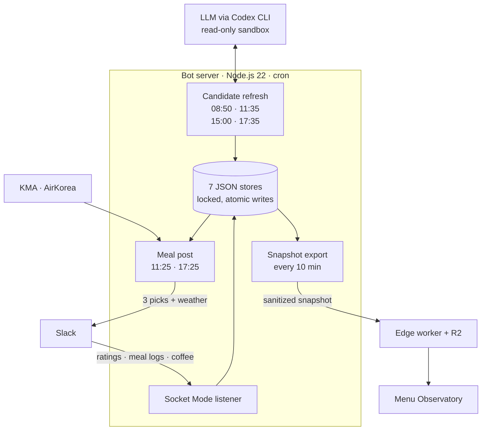

<div align="center">

**🇺🇸 English** · [🇨🇳 简体中文](README.zh-CN.md) · [🇭🇰 繁體中文](README.zh-HK.md) · [🇯🇵 日本語](README.ja.md) · [🇰🇷 한국어](README.ko.md)


# Ojeommwo · 오점뭐

**What's for lunch today?** A Slack bot that picks weekday lunch and dinner for a university lab,<br>
and a 3D observatory that turns every pick into a galaxy of shared taste.

[**Open the observatory**](https://ojeommwo-observatory.jumincho.chatgpt.site/) · [How it works](#how-it-works) · [Run it locally](#run-it-locally)

</div>

## Overview

*Ojeommwo* (오점뭐) is short for 오늘 점심 뭐 먹지?, Korean for "what's for lunch today?". It serves a research lab at Jeonbuk National University in Jeonju, Korea.

On weekdays at 11:25 and 17:25 KST, skipping public holidays, the bot posts three delivery picks to Slack. Lab members rate the picks and log what they actually ate. Those signals update a Bayesian taste model that shapes the next round, and the **Menu Observatory** publishes a sanitized view of the whole history as a galaxy you can fly through.

## Features

### Slack bot

- **Three distinct picks per meal.** Category, restaurant, dish and main protein all differ. Cooldowns keep a restaurant away for 14 days and a dish for 7.
- **Only verified candidates.** Each pick is checked for meal suitability, the actual branch, a price seen within 7 days and delivery evidence within 3 days, within 6 km of the lab's building. Closures and paused delivery remove a candidate. Delivery evidence means the branch delivers; whether it reaches your address at checkout is for the ordering app to confirm.
- **19 meal categories.** 한식, 치킨, 분식, 돈까스, 족발/보쌈, 찜/탕, 구이, 피자, 중식, 일식, 회/해물, 양식, 아시안, 샌드위치, 샐러드, 버거, 멕시칸, 도시락 and 죽. Standalone drinks, desserts and snacks are excluded.
- **Feedback in Slack.** Rate recommended menus from 1 to 5 with up to three tags, log meals (including ones that were not recommended), and answer the "coffee later?" poll.
- **Official weather.** Current, feels-like, high and low temperature, humidity, precipitation, weather warnings, UV and fine dust from the Korea Meteorological Administration and AirKorea.
- **An LLM where judgement helps, code everywhere else.** GPT-6 Luna (xhigh reasoning, through the Codex CLI) looks for new restaurants on the web, maps loosely typed meal logs to real branches and menus, and re-adjudicates ambiguous categories against the branch's own menu. It runs in a read-only sandbox and returns schema-validated JSON. Ranking, preference math, cooldowns, expiry, deduplication and storage are deterministic, tested code.

### Menu Observatory

- **3D Menu Cosmos** (3D 코스모스): categories are glowing hubs and menus orbit them as stars, each with a soft glow of its category colour. Drag to rotate, scroll to zoom, click a star for details.
- **A black hole at the edge of the galaxy.** The lab's officially banned menu sits at taste −∞, inside a black hole that is ray-traced live on the GPU. Light is bent through the Schwarzschild metric: the accretion disk burns brighter on the side turning toward you, its far half is lensed over and under the shadow, a thin photon ring traces the edge, and the stars behind are bent around it. Click it like any other star.
- **Taste Map** (취향 지도): every menu sits on a *dislike 0% · neutral 50% · like 100%* axis, one lane per category. Direction is shown with text, colour, symbol and pattern together, and a ranked list view is one click away.
- **Filters and search.** Select several categories at once, or search by menu, restaurant or main ingredient (try `pork`).
- **Menu details.** Preference, times recommended, times eaten, rating count and average, price and delivery freshness.
- **Menu browsing** (메뉴 둘러보기): five random menus along the bottom; press 다시 뽑기 to draw again.
- **Accessible by default.** Keyboard navigation with a ranked list, a reduced-motion mode that stills the rotation, the twinkling and the disk, and a fallback when WebGL is unavailable. The page loads once and never refreshes itself.

The observatory interface is in Korean.

## How it works



- **Candidates are prepared before posts.** Research and posting are separate jobs. Before each meal the bot re-verifies prices, delivery evidence, distance, cooldowns and diversity, and keeps enough for two meals: whichever three valid picks go out first, three more remain. It searches the web only when that pool runs short, plus an optional look for new restaurants at 11:35 (at most six searches for two restaurants, within 420 seconds). A failed optional search leaves the prepared pool intact.
- **Evidence stays honest.** A clear new price on the branch's current menu replaces the old one, while prices that disagree between sources are held back. Distances use coordinates read from the exact branch page, never the model's guess, and pages that were not actually visited are never stored as evidence.
- **Taste model.** Each menu has a Beta posterior that starts from a Beta(3, 3) prior. Meal logs weigh 1.0 and survey ratings 0.9, evidence decays with a 180-day half-life, and an 18% exploration rate keeps new options in rotation. Repeat votes by one person are damped: only the latest vote counts within a day, and the latest three days count at 1, 0.5 and 0.25. A meal log overrides surveys from the same day or earlier; later surveys still count and gradually retire the older meal signal. The result is a ranking signal, not a promise of satisfaction.
- **Safe storage.** Seven JSON stores (recommendations, delivery receipts, meals, candidates, surveys, coffee and the Slack outbox) with locks, atomic rename, fsync and integrity checks. Slack delivery goes through the outbox, so an uncertain send is never blindly repeated.
- **Health from real calls.** A real model call every morning at 07:40 checks that the LLM answers, and health reports the latest real call rather than only the token's expiry date.
- **Observatory pipeline.** Every ten minutes the server validates the database, exports a sanitized snapshot and publishes it to an edge worker backed by R2 object storage; a follow-up check compares the hash the public API serves. Browsers read the latest snapshot when the page opens.

## Tech stack

| Part | Built with |
| --- | --- |
| Bot | Node.js 22+ with no npm dependencies, Slack Web API and Socket Mode, Codex CLI |
| Data | KMA and AirKorea open APIs, JSON stores |
| Observatory | Next.js 16, React 19, vinext (Vite 8), TypeScript, three.js, 3d-force-graph, a GLSL ray-tracing pass for the black hole |
| Hosting | Workers-style edge function with R2 storage; a static export doubles as an offline viewer |

## Repository layout

```text
.
├── src/             Slack bot: recommender, candidate research, taste model, weather, storage
├── scripts/         Operational CLIs: health checks, audits, candidate refresh, scheduled posts
├── test/            Test suite for the bot
├── prompts/         JSON schemas for structured LLM output
├── config/          Restaurant and menu normalization aliases
├── data/            Seed menus and the holiday calendar (no operating data)
└── observatory/     Menu Observatory
    ├── app/         React UI: 3D cosmos, taste map, filters, detail panel, browsing strip
    ├── worker/      Edge worker: snapshot API, publish authentication, security headers
    ├── scripts/     Snapshot export, validation and publishing
    ├── tests/       Observatory tests
    └── public/data/ Sanitized sample snapshot for local preview
```

## Run it locally

### Observatory (no credentials needed)

Requires Node.js 22.13 or later with Corepack.

```sh
cd observatory
corepack pnpm install --frozen-lockfile
corepack pnpm dev
```

Open the URL the dev server prints. Without the snapshot API, the app falls back to the sample in `public/data/snapshot.json`.

```sh
corepack pnpm lint
corepack pnpm typecheck
corepack pnpm test
```

The tests use the sanitized sample and synthetic stores, so they run without the private operating database. The one integration check that needs the real stores is skipped here; it runs on the server.

### Bot

Requires Node.js 22 or later.

```sh
npm run check   # syntax and JSON checks
npm test        # unit tests; no Slack workspace or credentials needed
```

To run the bot in your own workspace, copy `.env.example` to `.env` and fill in a Slack bot token and an app-level token for Socket Mode, plus a data.go.kr service key if you want weather. Candidate research also needs a Codex CLI login. `npm run dry-run` builds a recommendation and prints it without posting.

## Privacy and security

- No tokens, API keys, OAuth state, logs or operating database are committed. Secrets live in `.env` and in protected files outside the project.
- The public snapshot holds aggregates only: menus, restaurants, categories, preference posteriors and counts. It contains no Slack user IDs, messages or channel data, and a validator rejects forbidden fields before anything is published.
- Publishing a snapshot requires a bearer token. For everyone else the site is read-only, served with a strict Content Security Policy, HSTS and anti-framing headers.

## Status

Version **3.0**, launched on 2026-09-25. The release is labelled *GPT-6 Astra Max*; the production model is GPT-6 Luna with xhigh reasoning.

New in 3.0:

- Surveys given after a meal log count again; an old meal log no longer masks them indefinitely.
- Fresher prices, coordinates from the branch's own page, and a retuned search for new restaurants.
- Main-ingredient tags corrected after Luna re-reviewed all 141 unique menus.
- Health checks based on real model calls, not only token expiry.
- Clearer 3D labels and more legible taste-map and card text.
- Tests that run from the public source, and image-size 2.0.3 with no known vulnerabilities.

Design notes (in Korean): [ARCHITECTURE.md](ARCHITECTURE.md) · [RELEASES.md](RELEASES.md) · [observatory/ARCHITECTURE.md](observatory/ARCHITECTURE.md) · [observatory/DESIGN.md](observatory/DESIGN.md)

## License

Released under the [MIT License](LICENSE).
