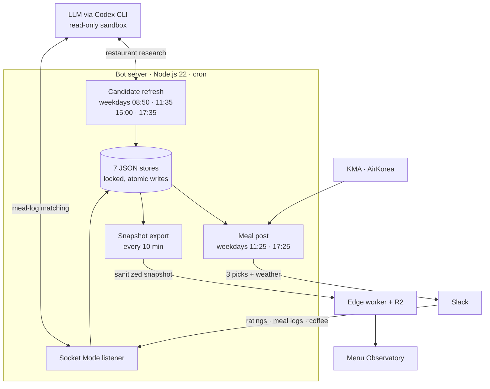

<div align="center">

**English** | [简体中文](README.zh-CN.md) | [繁體中文](README.zh-HK.md) | [日本語](README.ja.md) | [한국어](README.ko.md)


# Ojeommwo · 오점뭐

**What's for lunch today?** A Slack bot that picks weekday lunch and dinner for a university lab,<br>
and a 3D observatory that turns every pick into a galaxy of shared taste.

[**Open the observatory**](https://ojeommwo-observatory.jumincho.chatgpt.site/) · [How it works](#how-it-works) · [Run it locally](#run-it-locally) · [Releases](https://github.com/jumincho/ojeommwo/releases)

</div>

## Overview

*Ojeommwo* (오점뭐) abbreviates the Korean question *오늘 점심 뭐 먹지?* ("What's for lunch today?"). It serves a research lab at Jeonbuk National University (JBNU) in Jeonju, South Korea.

On weekdays at 11:25 and 17:25 KST, skipping public holidays, the bot posts three delivery picks and the weather to Slack. Lab members rate the picks and log what they actually ate. Those signals update a Bayesian taste model that shapes the next round, and the **Menu Observatory** publishes a sanitized, read-only view of recent picks and every verified menu as a galaxy you can fly through.

## Features

### Slack bot

- **Three distinct picks per meal.** Category, restaurant, dish and main protein all differ. After a restaurant is recommended or eaten it stays away for 14 days, and a dish for 7.
- **Only verified candidates.** A pick must suit a meal, match a real branch, have a price seen in the last 7 days and delivery evidence from the last 3 days, and be within 6 km (straight line) of the lab's building. Closures and paused delivery remove a candidate. Delivery evidence means the branch delivers; whether it reaches your address is for the ordering app to confirm at checkout.
- **19 meal categories.** 한식, 치킨, 분식, 돈까스, 족발/보쌈, 찜/탕, 구이, 피자, 중식, 일식, 회/해물, 양식, 아시안, 샌드위치, 샐러드, 버거, 멕시칸, 도시락 and 죽. Standalone drinks, desserts and snacks are excluded, and a clear dish form wins over an ingredient: a bulgogi pizza is still 피자.
- **Feedback in Slack.** Rate how appealing each recommended menu is from 1 to 5, whether or not you ate it. Log what you actually ate, including menus that were not recommended, with an optional 1–5 rating and up to three tags. Answer the "coffee later?" (이따 커피 마실 분?) poll.
- **Official weather.** Three Korea Meteorological Administration services and two AirKorea services cover the lab's location: current and feels-like temperature with the day's high and low, plus rain chances, weather warnings, high humidity, strong UV and poor air quality when they matter.
- **An LLM where judgement helps, code everywhere else.** GPT-6 Luna (xhigh reasoning, through the Codex CLI) looks for new restaurants on the web, matches loosely typed meal logs to real branches and menus, and re-adjudicates ambiguous categories against the branch's own menu. It runs in a read-only sandbox, returns schema-validated JSON and never writes the database. Ranking, preference maths, cooldowns, expiry, deduplication and storage are deterministic, tested code.

### Menu Observatory

- **3D Cosmos** (3D 코스모스): categories are glowing hubs and menus orbit them as stars, each with a soft glow in its category colour. Drag to rotate, scroll to zoom, click a star for details. 회전 끄기 ("stop rotation") pauses the auto-rotation and twinkling, and stars stay clickable while paused. When names crowd, a category label moves to a free side of its hub instead of disappearing, and a click within 12 px (22 px on touch) of a star still selects the nearest one.
- **A black hole at the edge of the galaxy.** The lab's officially banned menu sits at taste −∞, inside a black hole that is ray-traced live on the GPU. Light bends through the Schwarzschild metric: the accretion disk burns brighter on the side turning toward you, its far half is lensed over and under the shadow, a thin photon ring traces the edge, and the stars behind are bent around it. Click it like any other star. It is for display only and never affects recommendations.
- **Taste Map** (취향 지도): every menu sits on a *dislike 0% · neutral 50% · like 100%* axis, one lane per category. Direction is shown with text, colour, symbol and pattern together, and a ranked list (목록) is one click away.
- **Filters and search.** Select several categories at once, or search by menu, restaurant or main ingredient. Ingredient tags are bilingual, so `pork` and `돼지고기` find the same menus.
- **Menu details.** Preference, times recommended, times eaten, rating count and average, price and delivery freshness.
- **Menu browsing** (메뉴 둘러보기): five random menus from the current filter along the bottom; press 다시 뽑기 ("draw again") for a new set.
- **Accessible and honest.** Keyboard navigation with a ranked list, support for the system reduced-motion setting (it stills the rotation, the twinkling and the disk) and for forced-colour contrast themes, and a fallback when WebGL is unavailable. The animation stops if the GPU context is lost. The page loads its data once and never polls: expired prices and delivery claims disappear on a local timer, and if the network fails, the last good copy saved in the browser is shown with a notice.

The observatory interface is in Korean.

## How it works


```mermaid
flowchart TB
  llm["LLM via Codex CLI<br/>read-only sandbox"]
  weather["KMA · AirKorea"]
  subgraph bot["Bot server · Node.js 22 · cron"]
    refresh["Candidate refresh<br/>weekdays 08:50 · 11:35<br/>15:00 · 17:35"]
    post["Meal post<br/>weekdays 11:25 · 17:25"]
    store[("7 JSON stores<br/>locked, atomic writes")]
    listener["Socket Mode listener"]
    export["Snapshot export<br/>every 10 min"]
  end
  slack["Slack"]
  edge["Edge worker + R2"]
  browser["Menu Observatory"]

  llm <-->|"restaurant research"| refresh
  llm <-->|"meal-log matching"| listener
  weather --> post
  refresh --> store
  store --> post
  post -->|"3 picks + weather"| slack
  slack -->|"ratings · meal logs · coffee"| listener
  listener --> store
  store --> export
  export -->|"sanitized snapshot"| edge
  edge --> browser
```

### Recommendations

- **Candidates are prepared before posts.** Research and posting are separate jobs. Before each meal the bot re-verifies prices, delivery evidence, distance, cooldowns and diversity, and targets two independently usable sets of three picks. During the guarded 08:50–09:10 morning window, if that reserve cannot be filled, a revalidated single set may be retained for lunch; later refreshes replenish the reserve. It searches the web only when that pool runs short. At 11:35, and only when the pool is already full, it may also look for up to two new restaurants (the model gets a budget of six web searches and the job stops after 420 seconds); a failed optional search leaves the prepared pool intact. A post that would start more than 45 minutes late is skipped rather than sent.
- **Verified finds are kept.** The active shortlist holds up to twelve candidates. Verified finds that do not fit wait in a catalog of up to 120 and are re-verified twelve at a time in rotation, so a good new restaurant is not lost just because the shortlist was full.
- **Evidence stays honest.** A clear new price on the branch's current menu replaces the old one, while prices that disagree between sources are held back. Distances use coordinates read from the exact branch page, never the model's guess, and pages that were not actually visited are never stored as evidence. Closures and branch mismatches are removed for good, even from backups, while a temporary network error keeps evidence that is still valid.

### Taste model and ranking

- **Taste model.** Each menu has a Beta posterior that starts from a Beta(3, 3) prior. Meal logs weigh 1.0 and survey ratings 0.9 (in surveys a 2 or 4 counts half and a 3 is neutral), and evidence decays with a 180-day half-life. A vote also reaches similar menus: the same dish at another restaurant receives about 78% of it, another dish at the same restaurant about 56%, and other menus in the same category about 11%.
- **Repeat votes are damped.** Only a person's latest vote counts within a day, and their latest three days count at 1, 0.5 and 0.25. A meal log overrides surveys from the same day or earlier; later surveys still count and gradually retire the older meal signal. From a neutral 50%, one strong rating moves a menu to about 57%, ten from the same person on the same day still count once, and ten different people move it to 80%.
- **Ranking.** Each score mixes 82% of the posterior mean with an 18% random Beta sample, so the favourite is not picked every time. A well-evidenced restaurant that has not yet been recommended or logged as eaten gets a small 0.5-point bonus (less than one strong vote), but strong preferences, delivery-distance risk, cooldowns and diversity still come first. The observatory shows the stable posterior mean; the random part only affects ranking. The result is a ranking signal, not a promise of satisfaction.

### Operations and publishing

- **Safe storage.** Seven JSON stores (recommendations, delivery receipts, meals, candidates, surveys, coffee and the Slack outbox) with locks, atomic rename, fsync and integrity checks. Slack delivery goes through the outbox, so an uncertain send is never blindly repeated. Recommendation history is kept for 90 days, meal logs and survey ratings for 730.
- **Health from real calls.** A real model call every morning at 07:40 checks that the LLM answers, and health reports the latest real call rather than only the token's expiry date. Each Socket Mode connection has a deadline and a failed one is cleaned up before reconnecting, so a stalled handshake cannot leave a dead or duplicate listener.
- **Observatory pipeline.** Every ten minutes the server validates the database, exports a sanitized snapshot and publishes it to an edge worker backed by R2 object storage. The upload is chunked and hashed with SHA-256, and R2 writes are conditional, so a late retry never overwrites a newer snapshot; a follow-up check compares the hash the public API serves. Browsers read the latest snapshot once when the page opens, with a 10-second deadline for the API and a 5-second static fallback.

## Tech stack

| Part | Built with |
| --- | --- |
| Bot | Node.js 22+ with one pinned dependency (Undici 7.29.1), Slack Web API and Socket Mode, Codex CLI |
| Data | KMA and AirKorea open APIs, seven JSON stores |
| Observatory | Next.js 16, React 19, vinext (Vite 8), TypeScript, three.js, 3d-force-graph, a GLSL ray-tracing pass for the black hole |
| Hosting | Sites: a Workers-style edge function with R2 storage. The static export doubles as a loopback-only emergency viewer |

## Repository layout

```text
.
├── src/             Slack bot: recommender, candidate research, taste model, weather, storage
├── scripts/         Operational CLIs: health checks, audits, candidate refresh, scheduled posts
├── test/            Test suite for the bot
├── prompts/         JSON schemas for structured LLM output
├── config/          Restaurant and menu aliases for meal-log normalization
├── data/            Seed menus and the holiday calendar (no operating data)
└── observatory/     Menu Observatory
    ├── app/         React UI: 3D Cosmos, Taste Map, filters, detail panel, menu browsing
    ├── worker/      Edge worker: snapshot API, publish authentication, security headers
    ├── build/       Vite plugin for the Sites deployment metadata
    ├── scripts/     Snapshot export, validation and publishing; the emergency viewer
    ├── tests/       Observatory tests
    └── public/data/ Sanitized sample snapshot for local preview
```

## Run it locally

### Observatory (no credentials needed)

Requires Node.js 22.13 or later. Corepack ships with Node.js 22 and 24; on Node.js 25 or later, install it first with `npm install -g corepack`.

```sh
cd observatory
corepack pnpm install --frozen-lockfile
corepack pnpm dev
```

Open the URL the dev server prints. Without the snapshot API, the app falls back to the sample in `public/data/snapshot.json`.

```sh
corepack pnpm lint
corepack pnpm typecheck
corepack pnpm test
```

The tests use the sanitized sample and synthetic stores, so they run without the private operating database. They import the bot's own modules, which load the pinned Undici, so run `npm ci --omit=dev --ignore-scripts` at the repository root first. Windows-only checks, and the one integration check that needs the real stores, are skipped elsewhere.

### Bot

Requires Node.js 22 or later.

```sh
npm ci --omit=dev --ignore-scripts
npm run check   # syntax and JSON checks
npm test        # unit tests; no Slack workspace or credentials needed
```

To see a recommendation without Slack, print three picks from the bundled seed menus:

```sh
cp .env.example .env
RECOMMENDATION_MODE=static npm run dry-run
```

To run the bot in your own workspace:

- Put your channel IDs in `src/config.js` (`REQUIRED_LUNCH_CHANNEL_ID`, `REQUIRED_OPERATOR_DM_CHANNEL_ID`) and in `.env`. This copy ships with placeholders.
- Add a bot token with the `channels:read` and `chat:write` scopes and an app-level token for Socket Mode. Set `ENABLE_MEAL_FEEDBACK=true` for ratings, meal logs and the coffee poll.
- For weather, set `WEATHER_ENABLED=true` and a data.go.kr service key approved for all five services.
- Candidate research needs a dedicated Codex CLI login stored outside the project and outside `~/.codex`.
- `npm start` runs the Socket Mode listener. Posts and refreshes come from cron in Asia/Seoul time (see `scripts/pororo-crontab.txt`); the built-in scheduler stays off. Scheduled posts stop with an error in a year that `data/holiday-skip-dates.json` does not cover, and it currently covers 2026–2027.

## Privacy and security

- No tokens, API keys, OAuth state, logs or operating database are committed. Secrets live in `.env` and in protected files outside the project.
- The public snapshot holds no person-level data: menus, restaurants, categories, prices and evidence freshness, preference posteriors, counts and the timeline of posted picks. A validator rejects addresses, coordinates, evidence URLs and any Slack user, channel or message identifiers before anything is published.
- Publishing a snapshot requires a bearer token. For everyone else the site is read-only, served with a strict Content Security Policy, HSTS and anti-framing headers.
- Dependencies are locked and audited without an advisory ignore list.

## Status

Version **2.5** (2.5.0), released 2026-10-03 ([release notes](https://github.com/jumincho/ojeommwo/releases/tag/v2.5.0)). The release label is *GPT-6 Astra Ultra*; the runtime model remains GPT-6 Luna with xhigh reasoning.

- Scheduled-send guards and private-DM isolation protect shared meal history and taste.
- Verified catalog menus appear alongside historical taste, with bounded loading and honest expiry for price and delivery evidence.
- 3D and taste-map readability and selection are improved while keeping the current Korean wording and features.
- Locked dependencies, model authentication, the Korean weather sources (KMA and AirKorea), operating data and emergency guards were reviewed; see [QUALITY_REPORT.md](QUALITY_REPORT.md) for the verified scope.
- Claude Opus 5.5 Ultracode completed the frontend polish and five-language README rewrite in PR #3. Its v2.5 follow-up integration and deployment status are recorded in [HANDOFF.md](HANDOFF.md) and [QUALITY_REPORT.md](QUALITY_REPORT.md). The original v2.5.0 tag, release declaration and GPT-6 Luna / xhigh runtime remain unchanged.

Design and release notes: [ARCHITECTURE.md](ARCHITECTURE.md) · [RELEASES.md](RELEASES.md) · [QUALITY_REPORT.md](QUALITY_REPORT.md) · [MODEL_EVALUATION.md](MODEL_EVALUATION.md) · [observatory/DESIGN.md](observatory/DESIGN.md) (Korean)

## License

Released under the [MIT License](LICENSE).
