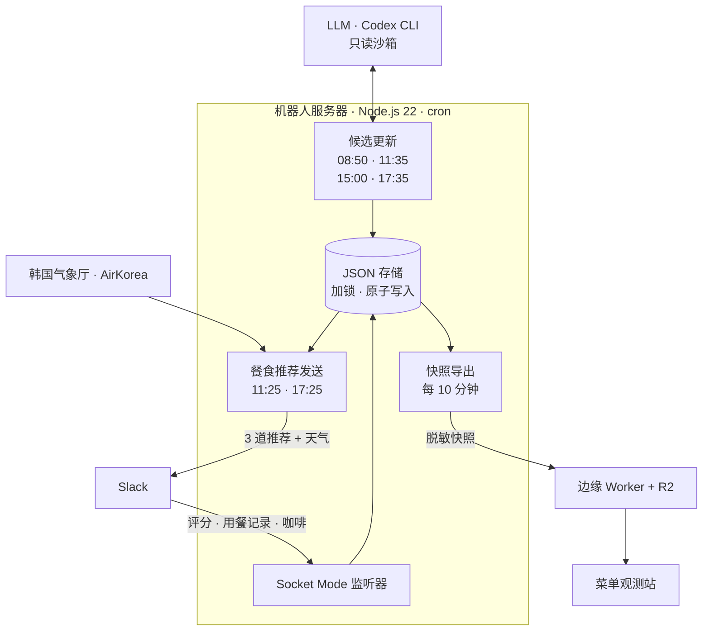

<div align="center">

[🇺🇸 English](README.md) · **🇨🇳 简体中文** · [🇭🇰 繁體中文](README.zh-HK.md) · [🇯🇵 日本語](README.ja.md) · [🇰🇷 한국어](README.ko.md)


# Ojeommwo · 오점뭐

**今天午饭吃什么？** 一个为大学实验室挑选工作日午餐和晚餐的 Slack 机器人，<br>
以及一座把每一次推荐都变成共同口味地图的 3D 观测站。

[**打开观测站**](https://ojeommwo-observatory.jumincho.chatgpt.site/) · [工作原理](#工作原理) · [在本地运行](#在本地运行)

</div>

## 简介

*Ojeommwo*（오점뭐）是韩语「오늘 점심 뭐 먹지?」（今天午饭吃什么？）的缩写。它是为韩国全州全北国立大学的一个研究室打造的。

每个工作日的 11:25 和 17:25（韩国时间，公众假期除外），机器人会在 Slack 上发布三道外卖推荐，它们的品类、餐厅和菜品各不相同。研究室成员为推荐打分，并记录自己实际吃了什么。这些信号会更新一个贝叶斯口味模型，从而影响下一轮推荐；**菜单观测站**则以脱敏的形式公开全部历史。

## 功能

### Slack 机器人

- **每餐三道互不相同的推荐。** 每次的品类、餐厅和菜品都不同。同一家餐厅 14 天内、同一道菜 7 天内不会再次出现。
- **只推荐经过验证的候选。** 逐一核实是否适合作为正餐、是否为真实门店、价格是否在 7 天内确认、外卖证据是否在 3 天内，以及是否在 6 公里范围内。一旦发现关店或暂停外卖，就会移出候选。
- **19 个餐食品类。** 한식、치킨、분식、돈까스、족발/보쌈、찜/탕、구이、피자、중식、일식、회/해물、양식、아시안、샌드위치、샐러드、버거、멕시칸、도시락、죽。单独的饮品、甜点和零食不在其列。
- **直接在 Slack 里反馈。** 为推荐菜品打 1–5 分并附上最多 3 个标签，记录实际吃过的菜（包括未被推荐的），还能回应“等会儿一起喝咖啡吗？”。
- **官方天气信息。** 基于韩国气象厅和 AirKorea 的数据，提供当前气温、体感温度、最高和最低气温、湿度、降水、天气预警、紫外线以及颗粒物浓度。
- **需要判断的地方交给 LLM，其余交给代码。** GPT-6 Luna（xhigh 推理，经由 Codex CLI）负责上网调研新候选、规范化随手输入的用餐记录，并重新裁定含糊的品类。它运行在只读沙箱中，只返回经过 schema 校验的 JSON。排序、偏好计算、有效期、去重和存储都由经过测试的确定性代码完成。

### 菜单观测站

- **3D 菜单宇宙**（3D 코스모스）：品类是发光的中心，菜品化作环绕它们的星星。拖动旋转，滚轮缩放，点击星星查看详情。
- **口味地图**（취향 지도）：每道菜按品类分行，排布在 *不喜欢 0% · 中立 50% · 喜欢 100%* 的轴上。方向同时用文字、颜色、符号和纹理区分，一键即可切换为按喜好排序的列表。
- **筛选与搜索。** 可以同时选择多个品类，也可以按菜品、餐厅或主要食材搜索（试试 `pork`）。
- **菜品详情。** 偏好度、被推荐次数、实际食用次数、评价数与平均分、价格以及外卖确认状态。
- **随便看看**（메뉴 둘러보기）：底部随机展示五道菜，点「다시 뽑기」（重新抽取）即可换一批。
- **默认无障碍。** 支持键盘导航、“减弱动态效果”设置，以及无法使用 WebGL 时的替代界面。页面只加载一次，不会自动刷新。

观测站界面为韩语。

## 工作原理



- **先备好候选，再发送。** 调研和发送是两个独立的任务，可选探索失败时会保留仍然有效的已备候选。每餐之前，机器人都会重新核验价格、外卖证据、距离、冷却期和多样性；只有已验证的候选不够时才上网搜索，另外在 11:35 进行一次寻找新餐厅的可选探索。
- **口味模型。** 每道菜都有一个从 Beta(3, 3) 先验出发的 Beta 后验分布。实际用餐的权重为 1.0，问卷评分为 0.9，证据按 180 天的半衰期衰减，并以 18% 的探索率不断引入新选项。同一个人的重复投票会被削弱：同一天只计最新一票，不同日期只计最近三天，权重依次为 1、0.5 和 0.25。用餐记录只替代同日及更早的问卷，之后的问卷仍会生效，且逐步减弱较早用餐记录的影响。结果只是排序信号，并不保证满意。
- **安全的存储。** JSON 文件配合文件锁、原子重命名、fsync 和完整性检查。Slack 消息经由 outbox 发送，结果不确定的发送不会被盲目重复。
- **观测站流水线。** 服务器每十分钟校验一次数据库，导出脱敏快照，并发布到以 R2 对象存储为后端的边缘 Worker。浏览器在打开页面时读取最新快照。

## 技术栈

| 部分 | 使用技术 |
| --- | --- |
| 机器人 | Node.js 22+（无 npm 依赖）、Slack Web API 与 Socket Mode、Codex CLI |
| 数据 | 韩国气象厅与 AirKorea 开放 API、JSON 存储 |
| 观测站 | Next.js 16、React 19、vinext（Vite 8）、TypeScript、three.js、3d-force-graph |
| 托管 | 以 R2 存储为后端的 Workers 式边缘函数；静态导出兼作离线查看器 |

## 仓库结构

```text
.
├── src/             Slack 机器人：推荐器、候选调研、口味模型、天气、存储
├── scripts/         运维 CLI：健康检查、审计、候选更新、定时发送
├── test/            机器人测试
├── prompts/         LLM 结构化输出所用的 JSON schema
├── config/          餐厅与菜品规范化别名
├── data/            初始菜品与节假日日历（不含运营数据）
└── observatory/     菜单观测站
    ├── app/         React 界面：3D 宇宙、口味地图、筛选、详情面板、随便看看
    ├── worker/      边缘 Worker：快照 API、发布认证、安全响应头
    ├── scripts/     快照导出、校验与发布
    ├── tests/       观测站测试
    └── public/data/ 供本地预览的脱敏示例快照
```

## 在本地运行

### 观测站（无需任何凭据）

需要 Node.js 22.13 或更高版本以及 Corepack。

```sh
cd observatory
corepack pnpm install --frozen-lockfile
corepack pnpm dev
```

打开开发服务器输出的地址。没有快照 API 时，应用会改为读取 `public/data/snapshot.json` 中的示例数据。

```sh
corepack pnpm lint
corepack pnpm typecheck
```

`corepack pnpm test` 在没有私有运营数据库时使用脱敏样本和合成数据。公开副本会明确跳过一项真实运营存储集成检查，该检查在服务器上执行。

### 机器人

需要 Node.js 22 或更高版本。

```sh
npm run check   # 语法与 JSON 检查
npm test        # 单元测试，无需 Slack 工作区或凭据
```

如需在自己的工作区运行，请将 `.env.example` 复制为 `.env`，填入 Slack 机器人令牌和用于 Socket Mode 的应用级令牌；如需天气功能，还要填入韩国公共数据门户（data.go.kr）的服务密钥。候选调研还需要登录 Codex CLI。`npm run dry-run` 会生成一次推荐并打印出来，不会发到 Slack。

## 隐私与安全

- 仓库中没有提交任何令牌、API 密钥、OAuth 状态、日志或运营数据库。密钥只保存在 `.env` 和项目之外的受保护文件中。
- 公开快照只包含汇总数据：菜品、餐厅、品类、偏好后验分布和计数。其中没有 Slack 用户 ID、消息或频道信息，发布前校验器会拒绝任何被禁止的字段。
- 发布快照需要 Bearer 令牌。对其他所有访问者而言，网站是只读的，并附带严格的内容安全策略（CSP）、HSTS 和禁止嵌套的响应头。

## 现状

版本 **3.0**，于 2026-09-25 正式上线。版本代号为 *GPT-6 Astra Max*；实际运行的模型是 xhigh 推理的 GPT-6 Luna。

设计文档（韩语）：[ARCHITECTURE.md](ARCHITECTURE.md) · [RELEASES.md](RELEASES.md) · [observatory/ARCHITECTURE.md](observatory/ARCHITECTURE.md) · [observatory/DESIGN.md](observatory/DESIGN.md)

## 许可证

本项目以 [MIT 许可证](LICENSE) 发布。
