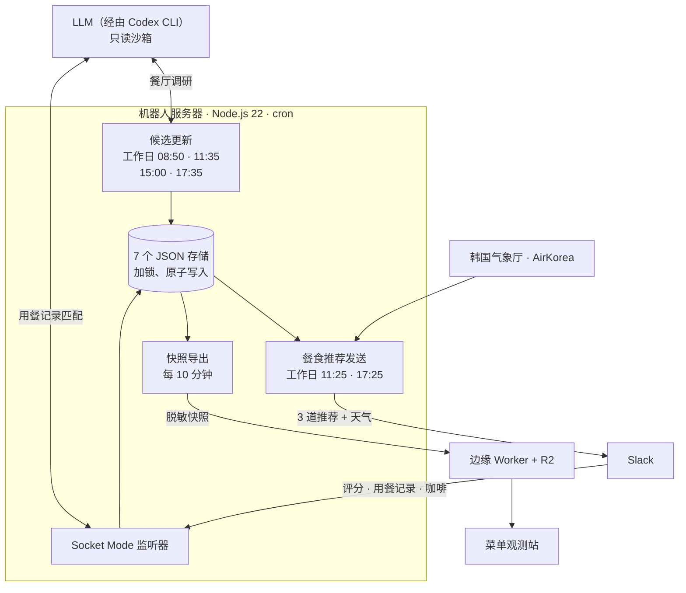

<div align="center">

[English](README.md) | **简体中文** | [繁體中文](README.zh-HK.md) | [日本語](README.ja.md) | [한국어](README.ko.md)


# Ojeommwo · 오점뭐

**今天午饭吃什么？** 一个为大学实验室挑选工作日午餐和晚餐的 Slack 机器人，<br>
以及一座把每一次推荐都变成共同口味银河的 3D 观测站。

[**打开观测站**](https://ojeommwo-observatory.jumincho.chatgpt.site/) · [工作原理](#工作原理) · [在本地运行](#在本地运行) · [版本发布](https://github.com/jumincho/ojeommwo/releases)

</div>

## 简介

*Ojeommwo*（오점뭐）是韩语问句 *오늘 점심 뭐 먹지?*（“今天午饭吃什么？”）的缩写。它服务于韩国全州全北国立大学（JBNU）的一个实验室。

每个工作日的 11:25 和 17:25（韩国时间，节假日除外），机器人会在 Slack 上发布三道外卖推荐和天气信息。实验室成员为推荐打分，并记录自己实际吃了什么。这些信号会更新一个贝叶斯口味模型，从而影响下一轮推荐；**菜单观测站**则以脱敏、只读的形式，把近期的推荐和所有经过验证的菜品公开展示为一片可以自由穿梭的银河。

## 功能

### Slack 机器人

- **每餐三道互不相同的推荐。** 品类、餐厅、菜品和主要蛋白质都各不相同。一家餐厅被推荐或被吃过之后，14 天内不会再出现；一道菜则是 7 天。
- **只推荐经过验证的候选。** 每道推荐都必须适合作为正餐、对应一家真实的门店、价格在最近 7 天内确认过、外卖证据在最近 3 天以内，并且距离实验室所在楼不超过 6 公里（直线距离）。关店或暂停外卖的候选会被移除。外卖证据只说明该门店提供外卖；能否送到你的地址，要在下单结账时由点餐应用确认。
- **19 个餐食品类。** 한식、치킨、분식、돈까스、족발/보쌈、찜/탕、구이、피자、중식、일식、회/해물、양식、아시안、샌드위치、샐러드、버거、멕시칸、도시락、죽。单独的饮品、甜点和零食不在其列；明确的菜式优先于食材：韩式烤牛肉（불고기）披萨依然算作 피자。
- **直接在 Slack 里反馈。** 无论有没有吃，都可以为每道推荐菜品的吸引力打 1 到 5 分。记录自己实际吃了什么（包括未被推荐的菜品），并可选择附上 1–5 分的评分和最多三个标签。还可以参与“待会儿喝咖啡吗？”（이따 커피 마실 분?）投票。
- **官方天气信息。** 韩国气象厅的三项服务和 AirKorea 的两项服务覆盖实验室所在位置：提供当前气温和体感温度，以及当天的最高和最低气温；必要时还会提示降水概率、天气预警、高湿度、强紫外线和较差的空气质量。
- **需要判断的地方交给 LLM，其余交给代码。** GPT-6 Luna（xhigh 推理，经由 Codex CLI）负责上网寻找新餐厅，把随手输入的用餐记录对应到真实的门店和菜品，并对照门店自己的菜单重新裁定含糊的品类。它运行在只读沙箱中，返回经过 schema 校验的 JSON，从不写入数据库。排序、偏好计算、冷却期、过期处理、去重和存储都由经过测试的确定性代码完成。

### 菜单观测站

- **3D 宇宙**（3D 코스모스）：品类是发光的中心，菜品化作星星环绕在周围，每颗星都带着所属品类颜色的柔和光晕。拖动可旋转，滚轮可缩放，点击星星即可查看详情。“회전 끄기”（停止旋转）会暂停自动旋转和闪烁，暂停期间星星仍可点击。名称拥挤时，品类标签不会消失，而是移到中心旁边的空位；点击位置离星星不超过 12 px（触屏上为 22 px）时，仍会选中最近的那颗星。
- **银河边缘的黑洞。** 实验室官方禁止的菜品位于口味 −∞，藏在一个由 GPU 实时光线追踪渲染的黑洞里。光线依照史瓦西度规弯曲：吸积盘转向你的一侧更加明亮，盘的远半边被引力透镜弯折到阴影的上方和下方，一道细细的光子环勾勒出边缘，背后的星光也绕着它弯折。它和其他星星一样可以点击。它仅用于展示，绝不会影响推荐。
- **口味地图**（취향 지도）：每道菜都排布在 *不喜欢 0% · 中立 50% · 喜欢 100%* 的轴上，每个品类一行。偏好方向同时用文字、颜色、符号和纹理来表示，按喜好排序的列表（목록）也只需一键即可打开。
- **筛选与搜索。** 可以同时选择多个品类，也可以按菜品、餐厅或主要食材搜索。食材标签是双语的，所以无论搜 `pork` 还是 `돼지고기`，找到的都是相同的菜品。
- **菜品详情。** 偏好度、被推荐次数、实际食用次数、评分数量与平均分、价格以及外卖信息的新鲜度。
- **菜单浏览**（메뉴 둘러보기）：底部随机展示当前筛选范围内的五道菜；点击“다시 뽑기”（重新抽取）即可换一批。
- **无障碍，信息如实。** 支持键盘导航和按喜好排序的列表，支持系统的“减弱动态效果”设置（会让旋转、闪烁和吸积盘静止）以及强制颜色模式下的对比度主题，无法使用 WebGL 时也有替代界面。GPU 上下文丢失时动画会停止。页面只加载一次数据，从不轮询：过期的价格和外卖信息会按本地计时器自动消失；如果网络出错，则会显示浏览器中保存的最近一份可用副本，并附上提示。

观测站界面为韩语。

## 工作原理


```mermaid
flowchart TB
  llm["LLM（经由 Codex CLI）<br/>只读沙箱"]
  weather["韩国气象厅 · AirKorea"]
  subgraph bot["机器人服务器 · Node.js 22 · cron"]
    refresh["候选更新<br/>工作日 08:50 · 11:35<br/>15:00 · 17:35"]
    post["餐食推荐发送<br/>工作日 11:25 · 17:25"]
    store[("7 个 JSON 存储<br/>加锁、原子写入")]
    listener["Socket Mode 监听器"]
    export["快照导出<br/>每 10 分钟"]
  end
  slack["Slack"]
  edge["边缘 Worker + R2"]
  browser["菜单观测站"]

  llm <-->|"餐厅调研"| refresh
  llm <-->|"用餐记录匹配"| listener
  weather --> post
  refresh --> store
  store --> post
  post -->|"3 道推荐 + 天气"| slack
  slack -->|"评分 · 用餐记录 · 咖啡"| listener
  listener --> store
  store --> export
  export -->|"脱敏快照"| edge
  edge --> browser
```

### 推荐

- **发送前先备好候选。** 调研和发送是两个独立的任务。每餐之前，机器人都会重新核验价格、外卖证据、距离、冷却期和多样性，并备足两餐的量：无论先发出的是哪三道有效推荐，都还剩下三道。只有候选池不足时，它才会上网搜索。在 11:35，并且仅在候选池已满时，它还可能额外寻找最多两家新餐厅（模型最多可进行六次网页搜索，任务在 420 秒后停止）；这项可选搜索失败时，已备好的候选池保持不变。如果某次发送的开始时间会推迟超过 45 分钟，就直接跳过，不再补发。
- **验证过的新发现会被保留。** 当前启用的入围名单最多容纳十二个候选。放不下的已验证候选会进入最多可容纳 120 个的目录等待，并按每次十二个轮流重新核验，因此一家好的新餐厅不会只因入围名单已满而被丢掉。
- **证据始终如实。** 门店当前菜单上出现明确的新价格时会替换旧价格，不同来源的价格互相矛盾时则暂缓采用。距离用从该门店页面读到的坐标计算，绝不用模型的猜测；没有实际访问过的页面绝不会被存为证据。已关店或门店不符的候选会被永久移除，连备份里也不保留；而遇到暂时的网络错误时，仍然有效的证据会被保留。

### 口味模型与排序

- **口味模型。** 每道菜都有一个从 Beta(3, 3) 先验出发的 Beta 后验分布。用餐记录的权重为 1.0，问卷评分为 0.9（问卷中 2 分或 4 分按一半计算，3 分视为中立），证据按 180 天的半衰期衰减。一次投票也会影响到相似的菜品：其他餐厅的同一道菜约获得这一票的 78%，同一餐厅的其他菜约 56%，同一品类的其他菜品约 11%。
- **重复投票会被削弱。** 同一个人在一天之内只计最新的一票，最近三天的票依次按 1、0.5 和 0.25 的权重计入。用餐记录会取代同一天或更早的问卷；之后的问卷仍会计入，并逐渐让较早的用餐信号退出。从中立的 50% 出发，一条强烈的评分会把菜品推到约 57%；同一个人同一天评十次仍只算一次，而十个不同的人会把它推到 80%。
- **排序。** 每个分数由 82% 的后验均值和 18% 的随机 Beta 抽样混合而成，所以最受欢迎的菜不会每次都被选中。证据充分、但既未被推荐过也未被记录吃过的餐厅会得到 0.5 分的小幅加分（不到一次强烈投票的分量）；不过，强烈的偏好、外卖距离风险、冷却期和多样性依然优先。观测站显示的是稳定的后验均值，随机部分只影响排序。结果只是排序信号，并不保证满意。

### 运营与发布

- **安全的存储。** 七个 JSON 存储（推荐、发送回执、用餐、候选、问卷、咖啡和 Slack outbox）均采用文件锁、原子重命名、fsync 和完整性检查。Slack 消息经由 outbox 发送，因此结果不确定的发送绝不会被盲目重复。推荐历史保留 90 天，用餐记录和问卷评分保留 730 天。
- **用真实调用判断健康状态。** 每天早上 07:40 实际调用一次模型，确认 LLM 能正常应答；健康检查报告的是最近一次真实调用的结果，而不只是令牌的到期日。每个 Socket Mode 连接都有时限，失败的连接会在重连前清理，因此卡住的握手不会留下失效或重复的监听器。
- **观测站流水线。** 服务器每十分钟校验一次数据库，导出脱敏快照，并发布到以 R2 对象存储为后端的边缘 Worker。上传会分块并计算 SHA-256 哈希，R2 采用条件写入，因此迟到的重试绝不会覆盖更新的快照；随后的检查会核对公开 API 提供的哈希。浏览器在页面打开时读取一次最新快照，API 的时限为 10 秒，静态回退的时限为 5 秒。

## 技术栈

| 部分 | 使用技术 |
| --- | --- |
| 机器人 | Node.js 22+（带一个固定版本的依赖 Undici 7.29.1）、Slack Web API 与 Socket Mode、Codex CLI |
| 数据 | 韩国气象厅与 AirKorea 开放 API、七个 JSON 存储 |
| 观测站 | Next.js 16、React 19、vinext（Vite 8）、TypeScript、three.js、3d-force-graph、用于黑洞的 GLSL 光线追踪通道 |
| 托管 | Sites：带 R2 存储的 Workers 式边缘函数。静态导出兼作仅限本机回环地址访问的应急查看器 |

## 仓库结构

```text
.
├── src/             Slack 机器人：推荐器、候选调研、口味模型、天气、存储
├── scripts/         运营 CLI：健康检查、审计、候选更新、定时发送
├── test/            机器人的测试套件
├── prompts/         LLM 结构化输出所用的 JSON schema
├── config/          用于用餐记录规范化的餐厅与菜品别名
├── data/            初始菜品与节假日日历（不含运营数据）
└── observatory/     菜单观测站
    ├── app/         React 界面：3D 宇宙、口味地图、筛选、详情面板、菜单浏览
    ├── worker/      边缘 Worker：快照 API、发布认证、安全响应头
    ├── build/       用于 Sites 部署元数据的 Vite 插件
    ├── scripts/     快照导出、校验与发布；应急查看器
    ├── tests/       观测站测试
    └── public/data/ 供本地预览的脱敏示例快照
```

## 在本地运行

### 观测站（无需任何凭据）

需要 Node.js 22.13 或更高版本。Node.js 22 和 24 自带 Corepack；在 Node.js 25 或更高版本上，请先用 `npm install -g corepack` 安装它。

```sh
cd observatory
corepack pnpm install --frozen-lockfile
corepack pnpm dev
```

打开开发服务器输出的地址。没有快照 API 时，应用会回退到 `public/data/snapshot.json` 中的示例数据。

```sh
corepack pnpm lint
corepack pnpm typecheck
corepack pnpm test
```

测试使用脱敏示例和合成存储，因此无需私有的运营数据库即可运行。测试会导入机器人自身的模块，而这些模块会加载固定版本的 Undici，所以请先在仓库根目录运行 `npm ci --omit=dev --ignore-scripts`。仅限 Windows 的检查，以及唯一一项需要真实存储的集成检查，在其他环境中会被跳过。

### 机器人

需要 Node.js 22 或更高版本。

```sh
npm ci --omit=dev --ignore-scripts
npm run check   # 语法与 JSON 检查
npm test        # 单元测试，无需 Slack 工作区或凭据
```

如需在不接入 Slack 的情况下查看推荐，可以用自带的初始菜品打印三道推荐：

```sh
cp .env.example .env
RECOMMENDATION_MODE=static npm run dry-run
```

要在自己的工作区运行机器人：

- 把你的频道 ID 填入 `src/config.js`（`REQUIRED_LUNCH_CHANNEL_ID`、`REQUIRED_OPERATOR_DM_CHANNEL_ID`）和 `.env`。本副本中提供的是占位值。
- 添加一个具有 `channels:read` 和 `chat:write` 权限范围的机器人令牌，以及一个用于 Socket Mode 的应用级令牌。设置 `ENABLE_MEAL_FEEDBACK=true` 以启用评分、用餐记录和咖啡投票。
- 如需天气功能，请设置 `WEATHER_ENABLED=true`，并填入已获准使用全部五项服务的 data.go.kr 服务密钥。
- 候选调研需要一份专用的 Codex CLI 登录信息，存放在项目和 `~/.codex` 之外。
- `npm start` 会运行 Socket Mode 监听器。发送和候选更新由 cron 按 Asia/Seoul 时间触发（见 `scripts/pororo-crontab.txt`）；内置调度器保持关闭。如果某一年不在 `data/holiday-skip-dates.json` 的覆盖范围内，定时发送会报错停止；该文件目前覆盖 2026–2027 年。

## 隐私与安全

- 仓库中没有提交任何令牌、API 密钥、OAuth 状态、日志或运营数据库。密钥保存在 `.env` 和项目之外的受保护文件中。
- 公开快照不含任何个人层面的数据，其内容为：菜品、餐厅、品类、价格与证据新鲜度、偏好后验分布、计数以及已发送推荐的时间线。在发布任何内容之前，校验器会拒绝地址、坐标、证据 URL 以及任何 Slack 用户、频道或消息标识符。
- 发布快照需要 Bearer 令牌。对其他所有人而言，网站是只读的，并附带严格的内容安全策略（CSP）、HSTS 和防止页面被嵌入框架的响应头。
- 依赖由锁文件固定，审计时不设任何安全公告忽略列表。

## 现状

版本 **2.5**（2.5.0），于 2026-10-03 发布（[发布说明](https://github.com/jumincho/ojeommwo/releases/tag/v2.5.0)）。发布标记为 *GPT-6 Astra Ultra*；实际运行的模型仍是采用 xhigh 推理的 GPT-6 Luna。

- 定时发送防护和私人 DM 隔离保护了共享的用餐历史和口味数据。
- 已验证的目录菜单与历史口味一同显示，并为加载设置时限，如实处理价格与外卖证据的过期。
- 在保留现有韩语文案和功能的前提下，改善了 3D 视图和口味地图的可读性与选择操作。
- 已审查锁定的依赖、模型认证、韩国气象数据源（韩国气象厅与 AirKorea）、运营数据和应急防护；验证范围见 [QUALITY_REPORT.md](QUALITY_REPORT.md)。
- 计划由 Claude Opus 5 Ultracode 进行后续一轮前端与 README 改进。

设计与发布说明：[ARCHITECTURE.md](ARCHITECTURE.md) · [RELEASES.md](RELEASES.md) · [QUALITY_REPORT.md](QUALITY_REPORT.md) · [MODEL_EVALUATION.md](MODEL_EVALUATION.md) · [observatory/DESIGN.md](observatory/DESIGN.md)（韩语）

## 许可证

本项目以 [MIT 许可证](LICENSE)发布。
