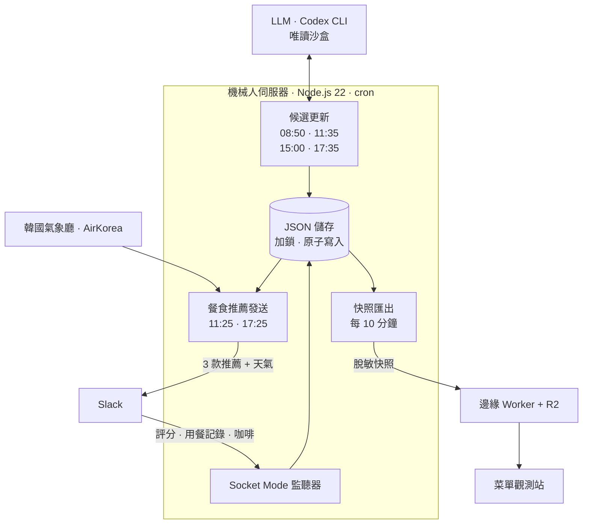

<div align="center">

[🇺🇸 English](README.md) · [🇨🇳 简体中文](README.zh-CN.md) · **🇭🇰 繁體中文** · [🇯🇵 日本語](README.ja.md) · [🇰🇷 한국어](README.ko.md)


# Ojeommwo · 오점뭐

**今天午餐吃甚麼？** 一個為大學研究室挑選平日午餐和晚餐的 Slack 機械人，<br>
以及一座把每一次推薦都化成共同口味地圖的 3D 觀測站。

[**開啟觀測站**](https://ojeommwo-observatory.jumincho.chatgpt.site/) · [運作原理](#運作原理) · [在本地運行](#在本地運行)

</div>

## 簡介

*Ojeommwo*（오점뭐）是韓語「오늘 점심 뭐 먹지?」（今天午餐吃甚麼？）的縮寫。它是為韓國全州全北國立大學的一個研究室而設的。

每個平日的 11:25 和 17:25（韓國時間，公眾假期除外），機械人會在 Slack 上發佈三款外賣推薦，它們的類別、餐廳和菜式各不相同。研究室成員為推薦評分，並記錄自己實際吃了甚麼。這些訊號會更新一個貝葉斯口味模型，從而影響下一輪推薦；**菜單觀測站**則以脫敏形式公開全部歷史。

## 功能

### Slack 機械人

- **每餐三款互不相同的推薦。** 每次的類別、餐廳和菜式都不同。同一間餐廳 14 天內、同一道菜 7 天內不會再次出現。
- **只推薦經過驗證的候選。** 逐一核實是否適合作正餐、是否真實分店、價錢是否在 7 天內確認、外賣證據是否在 3 天內，以及是否在 6 公里範圍內。一旦發現結業或暫停外賣，便會移出候選。
- **19 個餐食類別。** 한식、치킨、분식、돈까스、족발/보쌈、찜/탕、구이、피자、중식、일식、회/해물、양식、아시안、샌드위치、샐러드、버거、멕시칸、도시락、죽。單獨的飲品、甜品和小食不計在內。
- **直接在 Slack 內回饋。** 為推薦菜式評 1 至 5 分並附上最多 3 個標籤，記錄實際吃過的菜（包括未獲推薦的），亦可回應「待會一起喝咖啡嗎？」。
- **官方天氣資訊。** 根據韓國氣象廳和 AirKorea 的數據，提供現時氣溫、體感溫度、最高及最低氣溫、濕度、降雨、天氣警告、紫外線及懸浮粒子濃度。
- **需要判斷的地方交給 LLM，其餘交給程式碼。** GPT-6 Luna（xhigh 推理，經 Codex CLI）負責在網上搜集新候選、規範化隨手輸入的用餐記錄，並重新裁定含糊的類別。它在唯讀沙盒中運行，只會傳回經 schema 驗證的 JSON。排序、偏好計算、有效期、去重和儲存，全由經過測試的確定性程式碼處理。

### 菜單觀測站

- **3D 菜單宇宙**（3D 코스모스）：類別是發光的中心，菜式化作環繞它們的星星。拖曳旋轉、滾輪縮放，點擊星星即可查看詳情。
- **口味地圖**（취향 지도）：每道菜按類別分行，排列在 *不喜歡 0% · 中立 50% · 喜歡 100%* 的軸上。方向同時以文字、顏色、符號和紋理區分，一按即可切換成按喜好排序的清單。
- **篩選與搜尋。** 可同時選擇多個類別，也可按菜式、餐廳或主要食材搜尋（試試 `pork`）。
- **菜式詳情。** 偏好度、獲推薦次數、實際食用次數、評分數目與平均分、價錢及外賣確認狀態。
- **隨便看看**（메뉴 둘러보기）：底部隨機展示五道菜，按「다시 뽑기」（重新抽選）即可換一批。
- **預設無障礙。** 支援鍵盤操作、「減少動態效果」設定，以及無法使用 WebGL 時的替代畫面。頁面只載入一次，不會自動重新整理。

觀測站介面為韓文。

## 運作原理



- **先準備候選，再發送。** 搜集和發送是兩項獨立工作，搜尋失敗不會導致發送失敗。每餐之前，機械人都會重新核實價錢、外賣證據、距離、冷卻期和多樣性；只有已驗證的候選不足時才會上網搜尋，另外在 11:35 進行一次尋找新餐廳的可選探索。
- **口味模型。** 每道菜都有一個由 Beta(3, 3) 先驗出發的 Beta 後驗分佈。實際用餐的權重為 1.0，問卷評分為 0.9，證據按 180 天的半衰期遞減，並以 18% 的探索率持續引入新選擇。同一人的重複投票會被減弱：同一天只計最新一票，不同日子只計最近三天，權重依次為 1、0.5 和 0.25。結果只是排序訊號，並不保證滿意。
- **安全的儲存。** JSON 檔案配合檔案鎖、原子重新命名、fsync 和完整性檢查。Slack 訊息經 outbox 發送，結果不確定的發送不會被盲目重複。
- **觀測站流程。** 伺服器每十分鐘驗證一次數據庫，匯出經脫敏處理的快照，並發佈到以 R2 物件儲存為後端的邊緣 Worker。瀏覽器在開啟頁面時讀取最新快照。

## 技術棧

| 部分 | 使用技術 |
| --- | --- |
| 機械人 | Node.js 22+（沒有 npm 依賴）、Slack Web API 與 Socket Mode、Codex CLI |
| 數據 | 韓國氣象廳與 AirKorea 開放 API、JSON 儲存 |
| 觀測站 | Next.js 16、React 19、vinext（Vite 8）、TypeScript、three.js、3d-force-graph |
| 託管 | 以 R2 儲存為後端的 Workers 式邊緣函數；靜態匯出兼作離線檢視器 |

## 儲存庫結構

```text
.
├── src/             Slack 機械人：推薦器、候選搜集、口味模型、天氣、儲存
├── scripts/         營運 CLI：健康檢查、審核、候選更新、定時發送
├── test/            機械人測試
├── prompts/         LLM 結構化輸出所用的 JSON schema
├── config/          餐廳與菜式規範化別名
├── data/            初始菜式與假期日曆（不含營運數據）
└── observatory/     菜單觀測站
    ├── app/         React 介面：3D 宇宙、口味地圖、篩選、詳情面板、隨便看看
    ├── worker/      邊緣 Worker：快照 API、發佈認證、安全標頭
    ├── scripts/     快照匯出、驗證與發佈
    ├── tests/       觀測站測試
    └── public/data/ 供本地預覽的脫敏範例快照
```

## 在本地運行

### 觀測站（毋須任何憑證）

需要 Node.js 22.13 或以上版本及 Corepack。

```sh
cd observatory
corepack pnpm install --frozen-lockfile
corepack pnpm dev
```

開啟開發伺服器顯示的網址。沒有快照 API 時，應用程式會改為讀取 `public/data/snapshot.json` 內的範例數據。

```sh
corepack pnpm lint
corepack pnpm typecheck
```

`corepack pnpm test` 亦可運行，但部分測試需要以營運數據庫重建快照，而營運數據庫並不在本儲存庫內，因此這些測試在此會失敗。

### 機械人

需要 Node.js 22 或以上版本。

```sh
npm run check   # 語法與 JSON 檢查
npm test        # 單元測試，毋須 Slack 工作區或憑證
```

如要在自己的工作區運行，請把 `.env.example` 複製為 `.env`，填入 Slack 機械人權杖（token）和 Socket Mode 用的應用程式層級權杖；如需天氣功能，還要填入韓國公共數據入口網站（data.go.kr）的服務金鑰。候選搜集亦需要登入 Codex CLI。`npm run dry-run` 會產生一次推薦並印出，不會發佈到 Slack。

## 私隱與安全

- 儲存庫沒有提交任何權杖、API 金鑰、OAuth 狀態、日誌或營運數據庫。機密只保存在 `.env` 和項目以外的受保護檔案中。
- 公開快照只包含匯總數據：菜式、餐廳、類別、偏好後驗分佈和數目。當中沒有 Slack 用戶 ID、訊息或頻道資料，發佈前驗證器會拒絕任何被禁止的欄位。
- 發佈快照需要 Bearer 權杖。對其他所有訪客而言，網站是唯讀的，並附有嚴格的內容安全政策（CSP）、HSTS 及禁止嵌入的標頭。

## 現況

版本 **2.6**，於 2026-09-23 正式推出。版本代號為 *GPT-6 Sol Max (Daybreak Blue)*；實際運作的模型是 xhigh 推理的 GPT-6 Luna。

設計文件（韓文）：[ARCHITECTURE.md](ARCHITECTURE.md) · [RELEASES.md](RELEASES.md) · [observatory/ARCHITECTURE.md](observatory/ARCHITECTURE.md) · [observatory/DESIGN.md](observatory/DESIGN.md)

## 許可證

本項目以 [MIT 許可證](LICENSE) 發佈。
