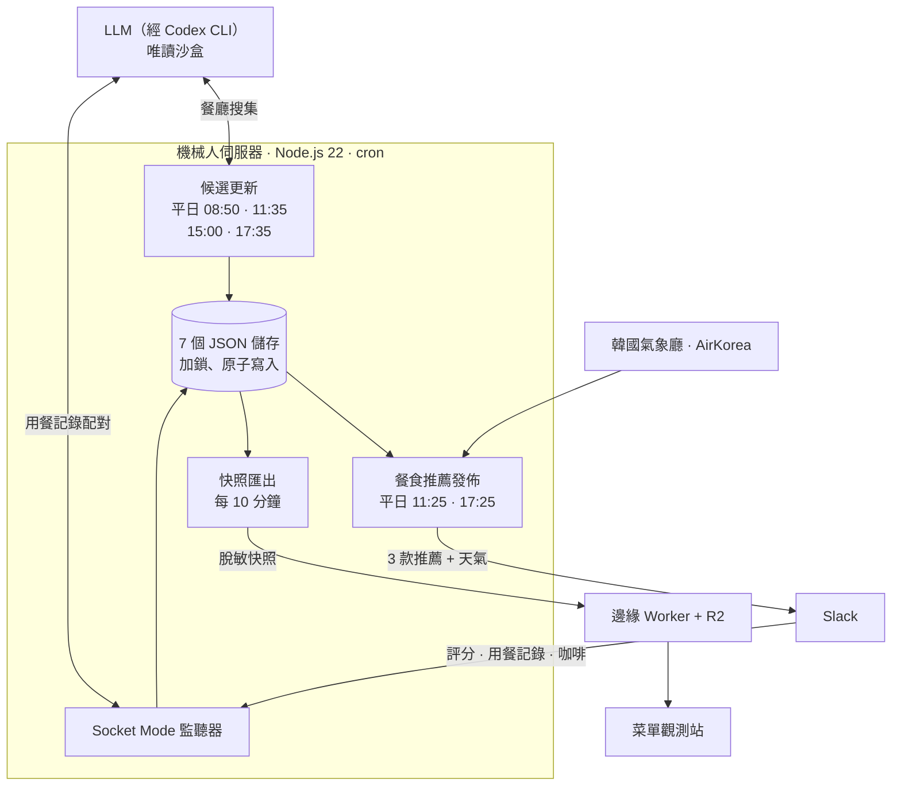

<div align="center">

[English](README.md) | [简体中文](README.zh-CN.md) | **繁體中文** | [日本語](README.ja.md) | [한국어](README.ko.md)


# Ojeommwo · 오점뭐

**今天午餐吃甚麼？** 一個為大學實驗室挑選平日午餐和晚餐的 Slack 機械人，<br>
以及一座把每一次推薦都化成共同口味銀河的 3D 觀測站。

[**開啟觀測站**](https://ojeommwo-observatory.jumincho.chatgpt.site/) · [運作原理](#運作原理) · [在本地運行](#在本地運行) · [版本發佈](https://github.com/jumincho/ojeommwo/releases)

</div>

## 簡介

*Ojeommwo*（오점뭐）是韓語問句「오늘 점심 뭐 먹지?」（今天午餐吃甚麼？）的縮寫。它是為韓國全州全北國立大學（JBNU）的一個研究實驗室而設的。

每個平日的 11:25 和 17:25（韓國時間，公眾假期除外），機械人會在 Slack 上發佈三款外賣推薦和天氣。實驗室成員為推薦評分，並記錄自己實際吃了甚麼。這些訊號會更新一個貝葉斯口味模型，從而影響下一輪推薦；**菜單觀測站**則把近期的推薦和每一道經驗證的菜式，以脫敏、唯讀的形式公開成一片可以自由穿梭的銀河。

## 功能

### Slack 機械人

- **每餐三款互不相同的推薦。** 類別、餐廳、菜式和主要蛋白質全都不同。餐廳一經推薦或被吃過，14 天內不會再出現；菜式則是 7 天。
- **只推薦經過驗證的候選。** 推薦必須適合作正餐、對應一間真實的分店、價錢在最近 7 天內確認過、外賣證據來自最近 3 天，並且位於實驗室大樓 6 公里（直線距離）範圍內。結業或暫停外賣的候選會被移除。外賣證據只表示該分店有提供外賣，能否送到你的地址，要在下單結帳時由外賣應用程式確認。
- **19 個餐食類別。** 한식、치킨、분식、돈까스、족발/보쌈、찜/탕、구이、피자、중식、일식、회/해물、양식、아시안、샌드위치、샐러드、버거、멕시칸、도시락、죽。單獨的飲品、甜品和小食不計在內；明確的菜式形態優先於食材：韓式烤牛肉（불고기）薄餅仍然算作 피자。
- **直接在 Slack 內回饋。** 無論有沒有吃，都可以為每道推薦菜式的吸引程度評 1 至 5 分。亦可記錄自己實際吃了甚麼（包括未獲推薦的菜式），並按需要附上 1–5 分的評分和最多三個標籤。還可以回應「待會喝咖啡嗎？」（이따 커피 마실 분?）投票。
- **官方天氣資訊。** 韓國氣象廳的三項服務和 AirKorea 的兩項服務涵蓋實驗室所在位置：提供現時氣溫和體感溫度，以及當日最高和最低氣溫；在有需要時，亦會提示降雨機會、天氣警告、高濕度、強烈紫外線和空氣質素欠佳。
- **需要判斷的地方交給 LLM，其餘交給程式碼。** GPT-6 Luna（xhigh 推理，經 Codex CLI）負責在網上尋找新餐廳，把隨手輸入的用餐記錄對應到真實的分店和菜式，並對照分店自己的餐牌重新裁定含糊的類別。它在唯讀沙盒中運行，只會傳回經 schema 驗證的 JSON，從不寫入數據庫。排序、偏好計算、冷卻期、有效期、去重和儲存，全由經過測試的確定性程式碼處理。

### 菜單觀測站

- **3D 宇宙**（3D 코스모스）：類別是發光的中心，菜式化作星星環繞它們，每顆星都帶着所屬類別顏色的柔和光暈。拖曳可旋轉，滾動可縮放，點擊星星即可查看詳情。「회전 끄기」（停止旋轉）會暫停自動旋轉和閃爍，暫停期間星星仍可點擊。名稱擠在一起時，類別標籤不會消失，而是移到中心周圍空出的一側；點擊位置距離星星 12 px 以內（觸控時為 22 px），仍會選中最近的那一顆。
- **銀河邊緣的黑洞。** 實驗室官方禁止的菜式位於口味 −∞，藏在一個由 GPU 實時光線追蹤的黑洞裏。光線依照史瓦西度規彎曲：吸積盤轉向你的一邊燒得更亮，盤的遠半邊被引力透鏡彎到陰影的上方和下方，一道細細的光子環勾勒出邊緣，背後的星光亦圍着它彎折。它和其他星星一樣可以點擊，不過只作展示，從不影響推薦。
- **口味地圖**（취향 지도）：每道菜都排列在 *不喜歡 0% · 中立 50% · 喜歡 100%* 的軸上，每個類別佔一行。方向同時以文字、顏色、符號和紋理表示，按一下即可切換到排名清單（목록）。
- **篩選與搜尋。** 可同時選擇多個類別，或按菜式、餐廳或主要食材搜尋。食材標籤是雙語的，所以搜尋 `pork` 或 `돼지고기` 都會找到相同的菜式。
- **菜式詳情。** 偏好度、獲推薦次數、實際食用次數、評分數目與平均分、價錢，以及外賣確認的新鮮度。
- **菜單瀏覽**（메뉴 둘러보기）：底部隨機展示目前篩選範圍內的五道菜；按「다시 뽑기」（重新抽選）即可換一批。
- **無障礙，資訊如實。** 可用鍵盤配合排名清單操作；支援系統的「減少動態效果」設定（會停下旋轉、閃爍和吸積盤）及強制色彩的對比主題；無法使用 WebGL 時亦有替代畫面。GPU 環境（context）遺失時動畫會停止。頁面只載入一次數據，從不輪詢：過期的價錢和外賣資訊會按本地計時器消失；如網絡出現故障，則會顯示瀏覽器內保存的最後一份正常副本，並附上提示。

觀測站介面為韓語。

## 運作原理


```mermaid
flowchart TB
  llm["LLM（經 Codex CLI）<br/>唯讀沙盒"]
  weather["韓國氣象廳 · AirKorea"]
  subgraph bot["機械人伺服器 · Node.js 22 · cron"]
    refresh["候選更新<br/>平日 08:50 · 11:35<br/>15:00 · 17:35"]
    post["餐食推薦發佈<br/>平日 11:25 · 17:25"]
    store[("7 個 JSON 儲存<br/>加鎖、原子寫入")]
    listener["Socket Mode 監聽器"]
    export["快照匯出<br/>每 10 分鐘"]
  end
  slack["Slack"]
  edge["邊緣 Worker + R2"]
  browser["菜單觀測站"]

  llm <-->|"餐廳搜集"| refresh
  llm <-->|"用餐記錄配對"| listener
  weather --> post
  refresh --> store
  store --> post
  post -->|"3 款推薦 + 天氣"| slack
  slack -->|"評分 · 用餐記錄 · 咖啡"| listener
  listener --> store
  store --> export
  export -->|"脫敏快照"| edge
  edge --> browser
```

### 推薦

- **先準備候選，再發佈。** 搜集和發佈是兩項獨立的工作。每餐之前，機械人都會重新核實價錢、外賣證據、距離、冷卻期和多樣性，以準備兩組各三款、可獨立使用的推薦為目標。在 08:50–09:10 的受限早上例外時段，如未能備足兩組，可以保留重新核實過的一組供午餐使用，再由後續更新補充儲備。只有在候選池不足時，才會上網搜尋。此外，只有在候選池已滿時，機械人才可能在 11:35 額外尋找最多兩間新餐廳（模型最多可進行六次網上搜尋，整項工作在 420 秒後停止）；這項可選搜尋即使失敗，已預備好的候選池亦維持不變。預計延遲超過 45 分鐘才開始的發佈會被略過，而不會照常發送。
- **經驗證的新發現會保留下來。** 現行候選名單最多容納十二個候選。放不進名單的已驗證新發現，會在最多可容納 120 個的目錄中等候，並每次十二個輪流重新核實，因此一間好的新餐廳不會只因名單已滿而被遺漏。
- **證據如實。** 分店現時餐牌上有明確的新價錢時，便會取代舊價錢；不同來源互相矛盾的價錢則會暫緩採用。距離以從該分店網頁讀取的座標計算，從不採用模型的猜測；沒有實際瀏覽過的網頁永遠不會被存為證據。已結業或分店不符的候選會被永久移除，連備份裏也不保留；遇到暫時的網絡錯誤時，仍然有效的證據會被保留。

### 口味模型與排序

- **口味模型。** 每道菜都有一個由 Beta(3, 3) 先驗出發的 Beta 後驗分佈。用餐記錄的權重為 1.0，問卷評分為 0.9（問卷中 2 分或 4 分只算一半，3 分屬中立），證據按 180 天的半衰期遞減。一票亦會影響相似的菜式：其他餐廳的同一道菜約得到這一票的 78%，同一餐廳的其他菜式約 56%，同類別的其他菜式約 11%。
- **重複投票會被減弱。** 同一人在一天內只計最新的一票，而此人最近三天的票，權重分別為 1、0.5 和 0.25。用餐記錄會取代同一天或更早的問卷；之後的問卷仍會計算在內，並逐步淘汰較早的用餐訊號。由中立的 50% 出發，一個強烈的評分會把菜式推到約 57%；同一人同一天評十次仍只算一次，而十個不同的人會把它推到 80%。
- **排序。** 每個分數由 82% 的後驗平均值和 18% 的隨機 Beta 抽樣混合而成，所以不會每次都選中最愛。證據充分但尚未獲推薦或被記錄為吃過的餐廳，會得到 0.5 分的小幅加分（影響小於一個強烈投票），不過強烈偏好、外賣距離風險、冷卻期和多樣性仍然優先。觀測站顯示的是穩定的後驗平均值；隨機部分只影響排序。結果只是排序訊號，並不保證滿意。

### 營運與發佈

- **安全的儲存。** 七個 JSON 儲存（推薦、發送回條、用餐、候選、問卷、咖啡和 Slack outbox），配合檔案鎖、原子重新命名、fsync 和完整性檢查。Slack 訊息經 outbox 發送，因此結果不確定的發送永遠不會被盲目重複。推薦歷史保留 90 天，用餐記錄和問卷評分保留 730 天。
- **以真實調用確認健康狀態。** 每天早上 07:40 實際調用一次模型，確認 LLM 能正常回應；健康檢查報告的是最近一次真實調用的結果，而不只是權杖的到期日。每個 Socket Mode 連線都設有時限，失敗的連線會在重新連線前清理，因此卡住的握手不會留下失效或重複的監聽器。
- **觀測站流程。** 伺服器每十分鐘驗證一次數據庫，匯出經脫敏處理的快照，並發佈到以 R2 物件儲存為後端的邊緣 Worker。上載會分塊並以 SHA-256 計算雜湊值，R2 採用條件式寫入，因此遲到的重試永遠不會覆蓋較新的快照；隨後的檢查會核對公開 API 提供的雜湊值。瀏覽器在開啟頁面時讀取一次最新快照，API 的時限為 10 秒，靜態後備則為 5 秒。

## 技術棧

| 部分 | 使用技術 |
| --- | --- |
| 機械人 | Node.js 22+（只有一個固定版本的依賴：Undici 7.29.1）、Slack Web API 與 Socket Mode、Codex CLI |
| 數據 | 韓國氣象廳與 AirKorea 開放 API、七個 JSON 儲存 |
| 觀測站 | Next.js 16、React 19、vinext（Vite 8）、TypeScript、three.js、3d-force-graph、用於黑洞的 GLSL 光線追蹤通道 |
| 託管 | Sites：以 R2 儲存為後端的 Workers 式邊緣函數。靜態匯出兼作只限本機迴路（loopback）存取的緊急檢視器 |

## 儲存庫結構

```text
.
├── src/             Slack 機械人：推薦器、候選搜集、口味模型、天氣、儲存
├── scripts/         營運 CLI：健康檢查、審核、候選更新、定時發佈
├── test/            機械人的測試套件
├── prompts/         LLM 結構化輸出所用的 JSON schema
├── config/          用於規範化用餐記錄的餐廳與菜式別名
├── data/            初始菜式與假期日曆（不含營運數據）
└── observatory/     菜單觀測站
    ├── app/         React 介面：3D 宇宙、口味地圖、篩選、詳情面板、菜單瀏覽
    ├── worker/      邊緣 Worker：快照 API、發佈認證、安全標頭
    ├── build/       用於 Sites 部署元數據的 Vite 插件
    ├── scripts/     快照匯出、驗證與發佈；緊急檢視器
    ├── tests/       觀測站測試
    └── public/data/ 供本地預覽的脫敏範例快照
```

## 在本地運行

### 觀測站（毋須任何憑證）

需要 Node.js 22.13 或以上版本。Node.js 22 和 24 已內置 Corepack；如使用 Node.js 25 或以上版本，請先以 `npm install -g corepack` 安裝。

```sh
cd observatory
corepack pnpm install --frozen-lockfile
corepack pnpm dev
```

開啟開發伺服器顯示的網址。沒有快照 API 時，應用程式會改為使用 `public/data/snapshot.json` 內的範例。

```sh
corepack pnpm lint
corepack pnpm typecheck
corepack pnpm test
```

測試使用脫敏範例和合成儲存，因此毋須私人的營運數據庫也能運行。測試會匯入機械人本身的模組，而這些模組會載入固定版本的 Undici，所以請先在儲存庫根目錄執行 `npm ci --omit=dev --ignore-scripts`。只限 Windows 的檢查，以及唯一一項需要真實儲存的整合檢查，會在其他環境中略過。

### 機械人

需要 Node.js 22 或以上版本。

```sh
npm ci --omit=dev --ignore-scripts
npm run check   # 語法與 JSON 檢查
npm test        # 單元測試，毋須 Slack 工作區或憑證
```

如想在不使用 Slack 的情況下查看推薦，可以從隨附的初始菜式印出三款推薦：

```sh
cp .env.example .env
RECOMMENDATION_MODE=static npm run dry-run
```

如要在自己的工作區運行機械人：

- 把你的頻道 ID 填入 `src/config.js`（`REQUIRED_LUNCH_CHANNEL_ID`、`REQUIRED_OPERATOR_DM_CHANNEL_ID`）和 `.env`。這份副本只附有佔位值。
- 加入具有 `channels:read` 和 `chat:write` 權限範圍的機械人權杖，以及 Socket Mode 用的應用程式層級權杖。如需評分、用餐記錄和咖啡投票，請設定 `ENABLE_MEAL_FEEDBACK=true`。
- 如需天氣功能，請設定 `WEATHER_ENABLED=true`，並提供已獲全部五項服務批准的 data.go.kr 服務金鑰。
- 候選搜集需要一份專用的 Codex CLI 登入資料，存放在項目及 `~/.codex` 以外的位置。
- `npm start` 會運行 Socket Mode 監聽器。發佈和更新由 cron 按 Asia/Seoul 時間觸發（見 `scripts/pororo-crontab.txt`）；內置的定時功能保持關閉。如某一年份不在 `data/holiday-skip-dates.json` 涵蓋範圍內，該年的定時發佈會報錯並停止；該檔案目前涵蓋 2026–2027 年。

## 私隱與安全

- 儲存庫沒有提交任何權杖、API 金鑰、OAuth 狀態、日誌或營運數據庫。機密只保存在 `.env` 和項目以外的受保護檔案中。
- 公開快照不含任何個人層面的數據，內容為菜式、餐廳、類別、價錢與證據新鮮度、偏好後驗分佈、次數，以及已發佈推薦的時間線。在發佈任何內容之前，驗證器會拒絕地址、座標、證據網址，以及任何 Slack 用戶、頻道或訊息的識別碼。
- 發佈快照需要 Bearer 權杖。對其他所有人而言，網站是唯讀的，並附有嚴格的內容安全政策（Content Security Policy）、HSTS 及防止被嵌入框架的標頭。
- 依賴以鎖定檔固定，審核時不設任何安全公告豁免清單。

## 現況

版本 **2.5**（2.5.0），於 2026-10-03 發佈（[發佈說明](https://github.com/jumincho/ojeommwo/releases/tag/v2.5.0)）。發佈標記為 *GPT-6 Astra Ultra*；實際運作的模型仍是 xhigh 推理的 GPT-6 Luna。

- 定時發送的防護條件與私人 DM 隔離，保護共同的用餐記錄和口味。
- 已驗證的目錄菜式與歷史口味一同顯示，並為載入設定時限，如實處理價錢與外賣證據的過期。
- 在保留現行韓語文案與功能的前提下，改善 3D 和口味地圖的可讀性與選取操作。
- 已審查鎖定依賴、模型認證、韓國天氣來源（韓國氣象廳及 AirKorea）、營運數據和緊急防護條件；驗證範圍見 [QUALITY_REPORT.md](QUALITY_REPORT.md)。
- Claude Opus 5.5 Ultracode 已完成 PR #3 的前端改善及五種語言 README 重寫。v2.5 後續整合及部署狀態記錄於 [HANDOFF.md](HANDOFF.md) 和 [QUALITY_REPORT.md](QUALITY_REPORT.md)。原有 v2.5.0 標籤、發佈聲明及 GPT-6 Luna / xhigh 運作模型維持不變。

設計及發佈文件：[ARCHITECTURE.md](ARCHITECTURE.md) · [RELEASES.md](RELEASES.md) · [QUALITY_REPORT.md](QUALITY_REPORT.md) · [MODEL_EVALUATION.md](MODEL_EVALUATION.md) · [observatory/DESIGN.md](observatory/DESIGN.md)（韓語）

## 授權

本項目以 [MIT 授權條款](LICENSE)發佈。
